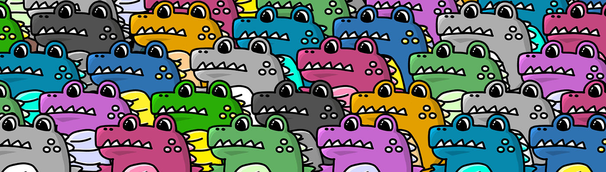

# Cute Gator Club Genesis

我们是一个 PFP 项目，旨在培养可爱、有趣、滑稽的冒险。

可爱 Gator Club Genesis NFT - 常见问题（FAQ）
▶ 什么是可爱的鳄鱼俱乐部创世纪？
Cute Gator Club Genesis 是一个 NFT（不可替代代币）系列。存储在区块链上的数字艺术品集合。
▶ 有多少个可爱的鳄鱼俱乐部创世纪代币？
总共有 1,540 个 Cute Gator Club Genesis NFT。目前，331 位所有者的钱包中至少有一个 Cute Gator Club Genesis NTF。
▶ 最昂贵的可爱鳄鱼俱乐部创世纪销售是什么？
售出的最昂贵的 Cute Gator Club Genesis NFT 是 Cute Gator Club Genesis #1323。它于 2022-06-05（3 个月前）以 32.8 美元的价格售出。
▶ 最近卖出了多少个可爱的鳄鱼俱乐部创世纪？
过去 30 天内售出了 44 个 Cute Gator Club Genesis NFT。
▶ 一个可爱的鳄鱼俱乐部创世纪要多少钱？
在过去 30 天里，Cute Gator Club Genesis NFT 最便宜的销售额低于 12 美元，最高销售额超过 33 美元。过去 30 天内，Cute Gator Club Genesis NFT 的中位价格为 21 美元。
▶ 什么是流行的可爱鳄鱼俱乐部创世纪替代品？
许多拥有Cute Gator Club Genesis NFT的用户还拥有 熟悉的记忆：

