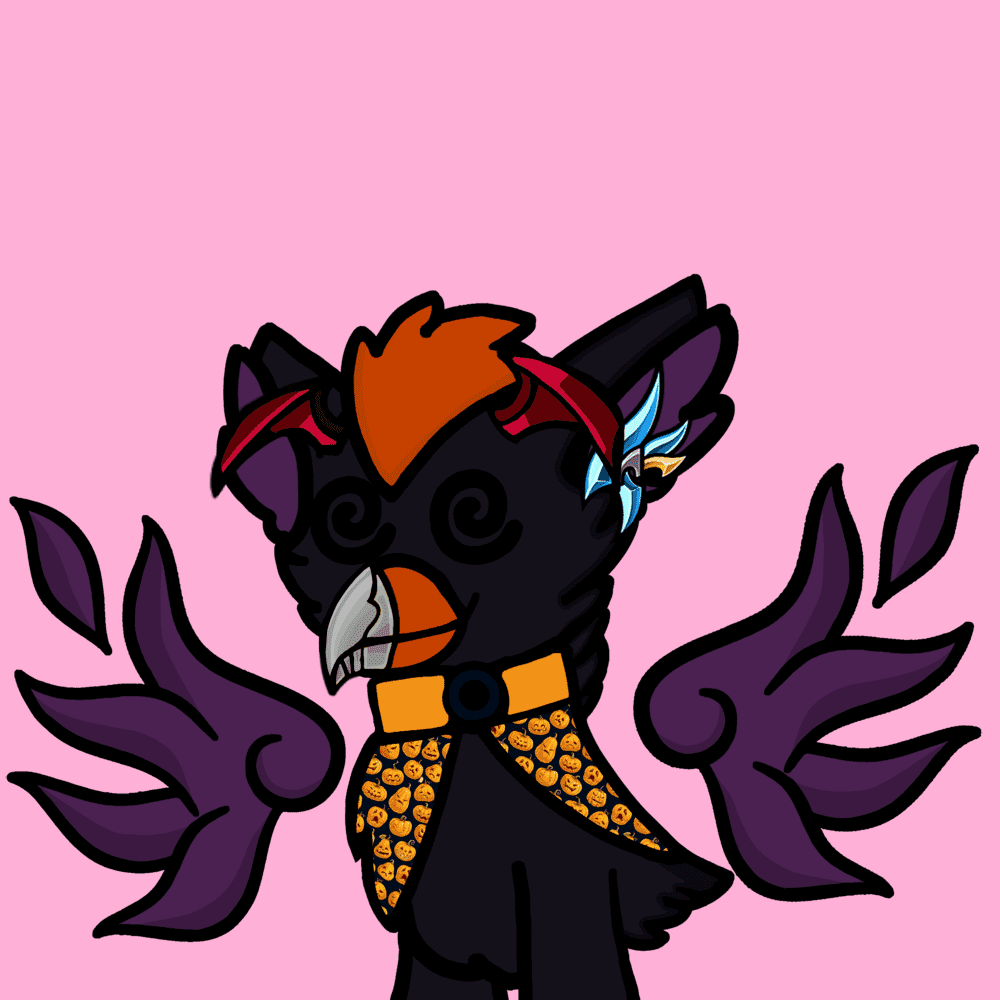

# Lil Hawk Cute Club

第一个让游戏赚钱变得负担得起的项目，加入我们 0.004

Lil Hawk Cute Club 是由去中心化自治组织 (DAO) SuNami Studios 策划的 10010 个程序化生成项目的集合 LHCC 与对我们来说由Sandbox提供支持的 Metaverse 完全兼容

LHCC 是一款基于IPFS中托管的GoDot引擎的玩赢游戏。每一个特质都有一个独特的 Atk+、Def- 和 HP* Lil Hawk Cute Club 拥有超过 600 多个特质和 10 个固定在IPFS中的属性。

每个 Lil Hawk 都有能力使用即将推出的成人血清进行改造。购买鹰以进入最友好的社区。

Lil Hawk Cute Club NFT - 常见问题（FAQ）
▶ 什么是小鹰可爱俱乐部？
Lil Hawk Cute Club 是一个 NFT（非同质代币）系列。存储在区块链上的数字艺术品集合。
▶ 有多少 Lil Hawk Cute Club 代币？
总共有 10,010 个 Lil Hawk Cute Club NFT。目前，172 位车主的钱包中至少有一个 Lil Hawk Cute Club NTF。
▶ 最近卖了多少 Lil Hawk Cute Club？
过去 30 天内共售出 0 个 Lil Hawk Cute Club NFT。
▶ 什么是流行的 Lil Hawk Cute Club 替代品？
许多拥有 Lil Hawk Cute Club NFT 的用户还拥有 Omni Bears、 Bee's Skully Universe、 加密大象俱乐部和 Hash Head。

