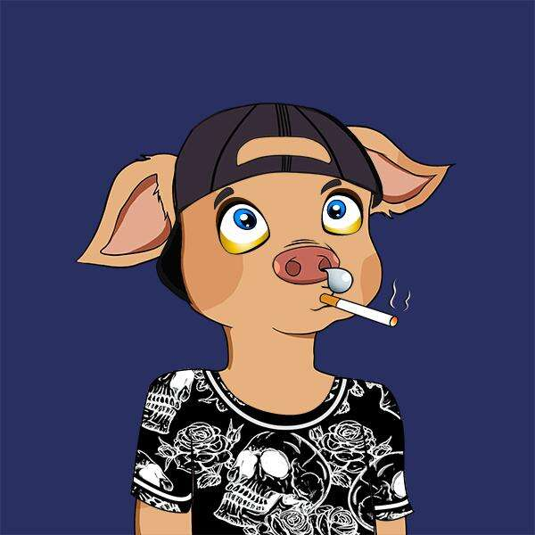

# Cute Pig Club

欢迎大家加入可爱猪俱乐部，NFT + DEFI
可爱的猪俱乐部是 10,000 个猪 NFT 的集合——生活在以太坊区块链上的独特数字收藏品。CPC 不仅是 NFT，也是 NFT + DEFI。
Q：如何购买可爱猪俱乐部 NFT？

A: 销售开始后，您可以在mint page购买。

Q：什么是可爱猪俱乐部 NFT？

A: 可爱猪俱乐部 (CPC) 是由 Theo Gamper 精心设计的 10,000 件艺术品。其中 22 幅是 1/1 手绘。

Q：Cute Pig Club NFT 是如何创建的？

A：CPC 是通过在以下类别中混合具有不同可能性的各种属性来通过算法构建的：背景、服装、面部、鼻子、嘴巴、帽子、项链、眼镜和配饰。其中 22 幅是手绘的。

问：22 1/1 手绘是什么意思？

答：在 10k 可爱猪俱乐部内，我们混合了 Theo Gamper 的 22 1/1 手绘。我们的团队没有保留任何一个，也不知道它们在哪里。你可以靠运气铸造它们。

Q：Cute Pig Club NFT 的价格是多少？

答：每铸币 0.03 eth（加气）。最大交易 100。

问：发布日期/时间是什么时候？

答：太平洋标准时间 8 月 6 日下午 3 点/东部时间下午 6 点

问：我什么时候可以看到我的猪（何时显示）？

A：即时显示（可能需要刷新 Opensea 上的元数据）

