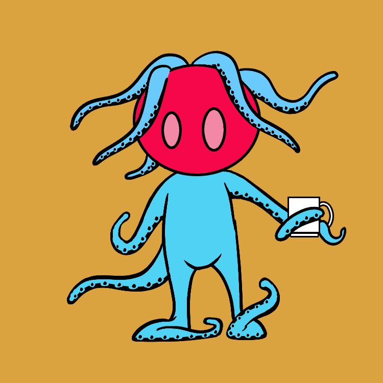

# Cute Tentacles

可爱的触手统计
创建于 8 个月前
312代币供应
10% 费用
过去 7 天没有售出可爱触手。

10k 可爱的触手.. 这有多有趣？！每个可爱的触手都有自己独特的品质，构成了这个系列，具有自己的稀有性，使每个 NFT 个体都以自己可爱的方式！以 Haxxodus Studios 的 David Skeleton 的艺术作品为特色。

可爱的触手 NFT - 常见问题（FAQ）
▶ 什么是可爱的触手？
Cute Tentacles 是一个 NFT（不可替代代币）集合。存储在区块链上的数字艺术品集合。
▶ 有多少可爱的触手代币？
总共有 312 个可爱的触手 NFT。目前 7 位所有者的钱包中至少有一个可爱的触手 NTF。
▶ 最近卖出了几只可爱触手？
过去 30 天内共售出 0 个 Cute Tentacles NFT。

