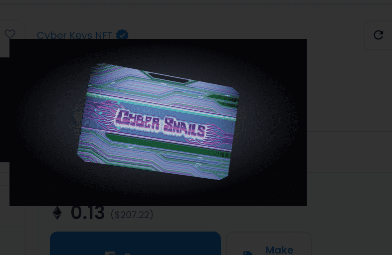

# Cyber Keys NFT

Cyber Snails项目由一群经验丰富的 NFT 交易者建立，旨在创建一个由经验丰富且相互联系的个人组成的高阿尔法社区。

该项目的使命是成为终极 NFT alpha 社区，并为成员提供工具、资源、信息和联系，以帮助他们成为更好的交易者。

该项目目前包括售罄的 Cyber Key NFT 系列和 Cyber.
网络钥匙分发给解谜的人。只有1000人通过。

密钥持有者在上传期间选择他们想带谁 - 选择特定的蓝筹项目以进入锁定的 Discord。

随着 The Upload 的临近，Discord 向其余公众开放。网络密钥持有者获得了一个拥有 2 个白名单铸币厂的位置，每个铸币厂以及 $UPLOAD 应计的未来几何加速。和早期的 alpha 访问。

其他人根据他们的社区贡献，每人加入 The Selected 以获得 1 个白名单位置。

上传开始...

