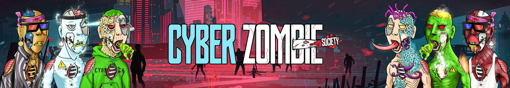

# Cyber Zombie Society

Cyber Zombie Society 是放置在以太坊区块链上的 3,333 个 NFT 的集合。Cyber Zombie Society 是一个由志同道合的个人、NFT 和加密爱好者、企业家和有远见的人组成的社区，他们喜欢分享知识并一起讨论想法！

Cyber Zombie Society NFT - 常见问题（FAQ）
▶ 什么是网络僵尸协会？
Cyber Zombie Society 是一个 NFT（Non-fungible token）集合。存储在区块链上的数字艺术品集合。
▶ Cyber Zombie Society 代币有多少？
总共有 1,032 个 Cyber Zombie Society NFT。目前，387 位所有者的钱包中至少有一个 Cyber Zombie Society NTF。
▶ Cyber Zombie Society 最昂贵的销售是什么？
最昂贵的 Cyber Zombie Society NFT 是 Cyber Zombie #953。它于 2022 年 6 月 12 日（2 个月前）以 61.6 美元的价格售出。
▶ 最近卖出了多少个 Cyber Zombie Society？
过去 30 天内售出了 1 个 Cyber Zombie Society NFT。

