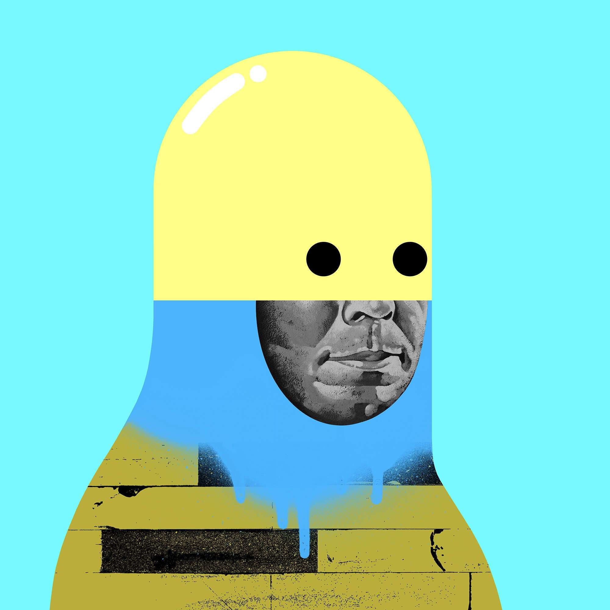

# Cyber Bandits by Michael Reeder

Cyber Bandits 是艺术家[Michael Reeder]的一个项目。该项目的主要重点是将 Reeder 的物理绘画风格与生成的 pfp 虚拟世界联系起来。多年来，里德的绘画利用了可互换性的一个方面，将图像从绘画循环到绘画。Reeder 笔下的大多数角色都具有相似的人物形状，充当构成人物生活的各部分的中心容器。就像一个生成项目一样，每个绘画人物都感觉相似和熟悉，但又新鲜、新颖和独特。利用实际物理绘画和数字渲染元素的剪报，Reeder 构建了一个图像目录，专门通过生成器运行以创建 Cyber Bandits。

