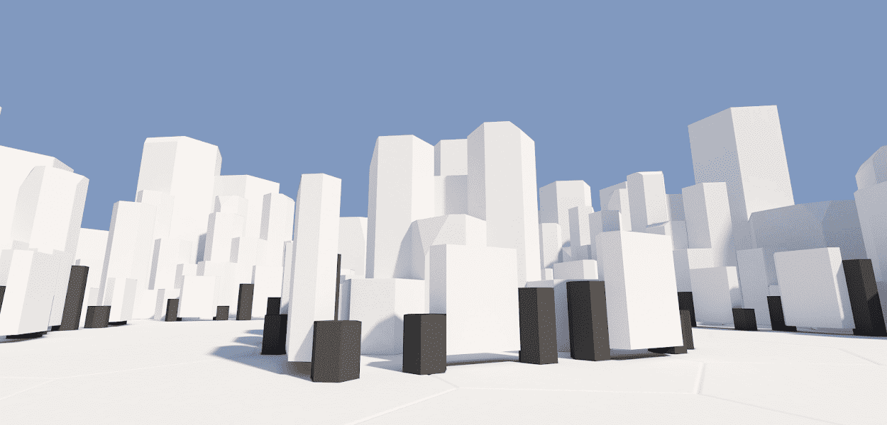

# Cyber Destinations Curated

网络是一个与众不同的元宇宙。只需点击 5 次，任何人都可以在预先存在的目的地使用他们的 NFT 创建数字体验并进行分享。其中一些目的地的数量有限。

Cyber Curated 系列中的数字空间因其严谨的创作过程和独创性而经过精心挑选。

通过购买此收藏中的物品，您可以将其用作您的数字资产 oncyber.io 的 3D 展览空间

Cyber Curated NFT - 常见问题（FAQ）
▶ 什么是网络策划？
Cyber Curated 是一个 NFT（不可替代令牌）集合。存储在区块链上的数字艺术品集合。
▶ 存在多少个 Cyber Curated 代币？
总共有 3 个 Cyber Curated NFT。目前，74 位所有者的钱包中至少有一个 Cyber Curated NTF。
▶ 最近售出了多少 Cyber Curated？
过去 30 天内售出 0 个 Cyber Curated NFT。

