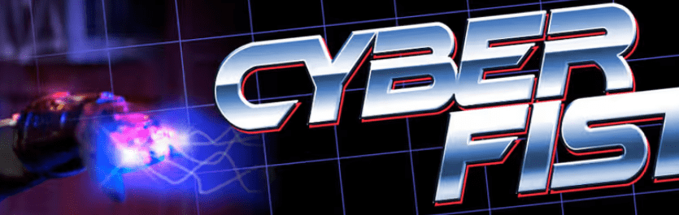

# Cyberfist Collection

一部以 80 年代为背景的真人喜剧多季流媒体系列。由马特·海利 (Marvel/DC 漫画) 撰写。为了使 Cyberfist 成为一个完全联合的流媒体系列，我们与伟大的 Robbie Trevino（Magic the Gathering，Lucasfilm Illustrator）合作为 Cyberfist 创建了 10k 件系列。

CYBERFIST 是一部动作喜剧系列，记录了 JANE WING 的冒险经历，她是一家大型玩具集团WINNERCO 的研发主管。

简偷偷篡夺了他们巨大的资源来打造她梦想中的发明——“赛博拳”——她希望将用于帮助有需要的人的技术杰作。

被一个狡猾的初级行政人员揭发，简被威胁要入狱，除非她交出原型并使用里克班农完成测试 - 一个愚蠢的演员，认为他在街上拍摄玩具广告，但实际上是在使用一种极其危险的武器！与 WINNERCO 将她的作品出售给军队的邪恶计划作斗争，简拒绝训练新一代士兵使用他们从小就使用的武器……

这个系列不是关于一个可以预见的与本周恶棍作战的高科技犯罪斗士。这是关于学会接受彼此的差异并愿意合作。为伟大而奋斗，在不可能的情况下取得胜利，为更大的利益而牺牲，这就是我们希望通过 CYBERFIST 表现出来的；人们真的可以变得比他们各部分的总和更大——即使他们讨厌彼此的胆量，也可以通过共同努力！

