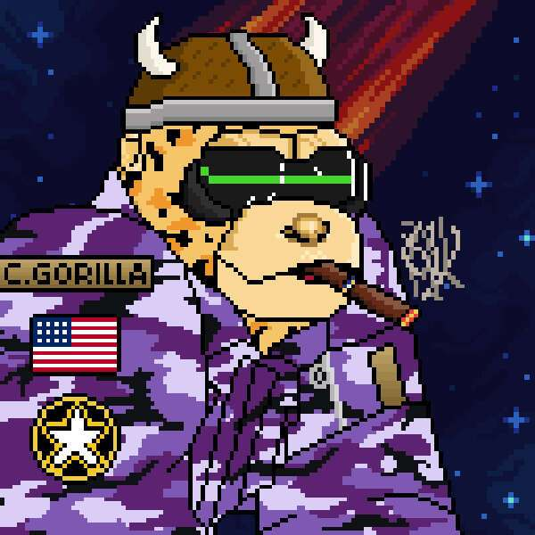

# Cyber Gorillas Official

CyberGorillas 是 3333 只随机生成的 Cyber 主题大猩猩的集合，其中包括 333 只创世纪 CyberGorillas。

重点关注功能支持的实用程序、合作伙伴关系和工具。优先考虑燃烧和通货紧缩机制。

游戏化市场和拍卖行即将推出。

CyberKings │ Baby CyberGorillas │ CyberBananas

当您的 NFT 被质押在智能合约中时，它们可能会积累一个实用代币（“CYBER”）。除了 Cyber Gorillas 生态系统之外，CYBER 没有其他功能，并且不能从 Cyber Gorillas Developers 购买。Cyber Gorillas 开发人员不提供也不打算为 CYBER 提供二级市场。

