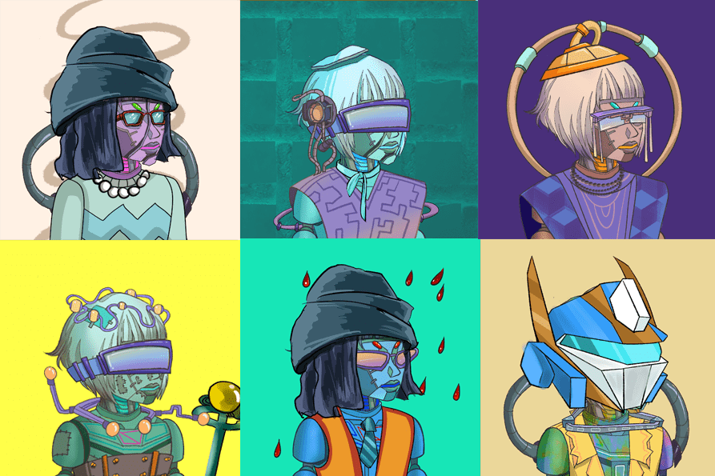

# CyberHex

CyberHex 是一个 2D 生成集合，包含 200 个完全独特的 CyberHex 化身，生活在 Polygon 区块链上。每个 CyberHex 都有自己的属性、优势和能力，没有两个头像是相同的。拥有 CyberHex NFT 使您成为全球独家代币持有者社区的一员。使用您的 CyberHexes 作为您在 Metaverse 中的身份或在二级市场上交易它们。欢迎来到俱乐部。

CyberHex NFT - 常见问题（FAQ）
▶ 什么是 CyberHex？
CyberHex 是一个 NFT（不可替代代币）集合。存储在区块链上的数字艺术品集合。
▶ 有多少 CyberHex 代币？
总共有 177 个 CyberHex NFT。目前，62 位所有者的钱包中至少有一个 CyberHex NTF。
▶ 最近卖出了多少 CyberHex？
过去 30 天内售出 0 个 CyberHex NFT。

