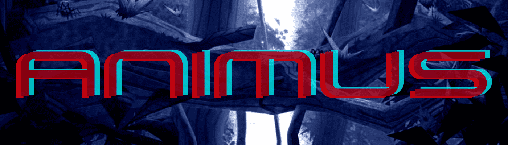

# Cyber Hornets Animus

在以太坊区块链上铸造的 6,666 个 Animus NFT 即将入侵 The Hive，以在新游戏中寻找女王的珍贵 $VENOM 以赢得战略赌注发展。

Animus 系列的艺术品由 Elliot Fernandez 专业插画家和平面设计师完成，他曾为 DC Universe 和 Marvel 工作，并将他的追随者和对艺术的热爱带到了黄蜂队！

Cyber Hornets Animus NFT - 常见问题（FAQ）
▶ 什么是 Cyber Hornets Animus？
Cyber Hornets Animus 是一个 NFT（非同质代币）集合。存储在区块链上的数字艺术品集合。
▶ 网络大黄蜂 Animus 代币有多少？
总共有 1,703 个 Cyber Hornets Animus NFT。目前，379 位车主的钱包中至少有一个 Cyber Hornets Animus NTF。
▶ Cyber Hornets Animus 最昂贵的交易是什么？
售出的最昂贵的 Cyber Hornets Animus NFT 是 . 它于 2022-06-04（3 个月前）以 47.3 美元的价格售出。
▶ 最近卖出了多少个 Cyber Hornets Animus？
过去 30 天内共售出 21 个 Cyber Hornets Animus NFT。
▶ Cyber Hornets Animus 的价格是多少？
在过去 30 天里，Cyber Hornets Animus NFT 最便宜的销售额低于 21 美元，最高销售额超过 47 美元。Cyber Hornets Animus NFT 在过去 30 天内的中位价格为 25 美元。
▶ 什么是流行的 Cyber Hornets Animus 替代品？
许多拥有 Cyber Hornets Animus NFT 的用户还拥有 Cyber Hornets Colony Club、 Funky Monkey Frat House、 Cyber Ape Yacht Club Official和 PoodleDunk。

