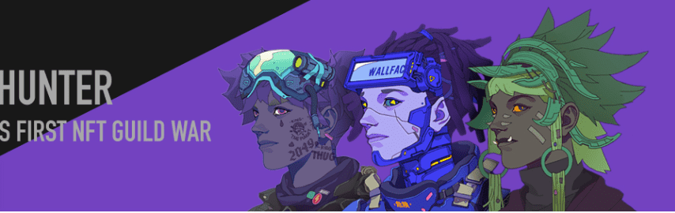

# CyberHunter

CyberHunter是一系列以赛博朋克为背景的元宇宙游戏英雄角色资产，通过算法组合6种属性，300个造型组件，首批共创建3000个角色。每个角色都匹配一个随机生成的服装条目和分数。这些英雄将分为三个不同的派系（原力、野兽、灰烬），每个派系有 1000 个角色。NFT 持有者将能够参与游戏中正在进行的一系列社区驱动的活动，获胜阵营将获得金币 (ERC-20)。硬币 (ERC20) 将通过 CyberHunter 全球玩家联盟社区的投票来命名和奖励。CyberHunter 拥有者可以获得完整的设计资产包，可提供高达 3000x3000 分辨率的打印级质量。

CyberHunter NFT - 常见问题（FAQ）
▶ 什么是 CyberHunter？
CyberHunter 是一个 NFT（非同质代币）集合。存储在区块链上的数字艺术品集合。
▶ 有多少 CyberHunter 代币？
总共有 3,000 个 CyberHunter NFT。目前 513 位所有者的钱包中至少有一个 CyberHunter NTF。
▶ 最近售出了多少 CyberHunter？
过去 30 天内售出 0 个 CyberHunter NFT。
▶ 什么是流行的 CyberHunter 替代品？
许多拥有 CyberHunter NFT 的用户还拥有 Vegiemon、 Sleeper Hits Collection Volume 1 NFT Cribs、 WALTZ和 Purrnelopes Grandmas。

