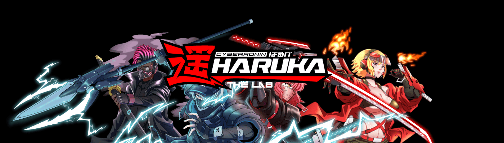

# CyberRonin Haruka Reveal

CyberRonin Haruka，又名 Haruka Ronin，是 5555 个化身的有限集合，将元宇宙连接到物理世界。5555件代表了Haruka CYBERRONIN家族对抗邪恶原田家族的暴政和控制的精神。

CyberRonin Haruka 揭示 NFT - 常见问题 (FAQ)
▶ 什么是 CyberRonin Haruka Reveal？
CyberRonin Haruka Reveal 是一个 NFT（非同质代币）集合。存储在区块链上的数字艺术品集合。
▶ CyberRonin Haruka Reveal 代币有多少？
总共有 5,000 个 CyberRonin Haruka Reveal NFT。目前有 2 位拥有者的钱包中至少有一个 CyberRonin Haruka Reveal NTF。
▶ CyberRonin Haruka Reveal 最近卖出了多少？
过去 30 天内共售出 0 个 CyberRonin Haruka Reveal NFT。

