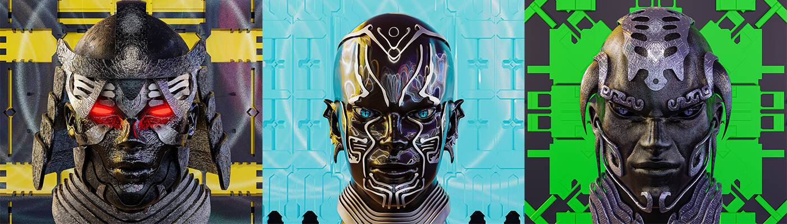

# CyberSquad

CyberSquad 是一个系列，包含具有独特身份和背景故事的独特角色。这个群体的每个成员都有独特的非凡力量和外表。每个成员都有不同的故事。网络小队最初是一群非凡的人，他们聚集在一起抢劫星际银行。从那以后，小队扩大了成员，改变了控制宇宙的目标。它们是有史以来最危险的星系团。他们目前被星际空间安全部（IGSSD）通缉。

CyberSquad NFT - 常见问题（FAQ）
▶ 什么是 CyberSquad？
CyberSquad 是一个 NFT（不可替代令牌）集合。存储在区块链上的数字艺术品集合。
▶ CyberSquad 代币有多少？
总共有 54 个 CyberSquad NFT。目前，31 位所有者的钱包中至少有一个 CyberSquad NTF。
▶ 最近卖出了多少 CyberSquad？
过去 30 天内售出 0 个 CyberSquad NFT。

