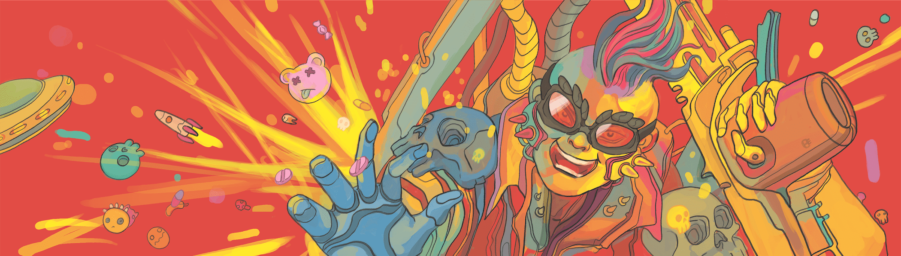

# CYBERUNNERS: Neo Genesis

CYBERUNNERS: Neo Genesis 是组成 CYBERUNNERS 特许经营权的四部分系列的第一部。这些掉落物为您带来了来自反乌托邦未来的前 555 个独特插图的反叛者。

CYBERUNNERS 古怪的艺术风格从阿基拉、攻壳机动队、银翼杀手和疯狂麦克斯等流行文化经典中汲取灵感！该项目提供了一个有远见的路线图和实用程序，其中包括诸如出版漫画书、社区合作项目、电视节目试点、P2E 元界平台等里程碑！

CYBERUNNERS：Neo Genesis NFT - 常见问题（FAQ）
▶ 什么是 CYBERUNNERS：Neo Genesis？
CYBERUNNERS：Neo Genesis 是一个 NFT（不可替代令牌）集合。存储在区块链上的数字艺术品集合。
▶ CYBERUNNERS: Neo Genesis 代币有多少？
总共有 555 个 CYBERUNNERS：Neo Genesis NFT。目前，268 位所有者的钱包中至少有一个 CYBERUNNERS: Neo Genesis NTF。
▶ CYBERUNNERS: Neo Genesis 最贵的促销是什么？
最昂贵的 CYBERUNNERS: Neo Genesis NFT 是 CYBERUNNER #304。它于 2022-06-10（3 个月前）以 104.4 美元的价格售出。
▶ CYBERUNNERS: Neo Genesis 最近卖出了多少？
过去 30 天内售出了 13 个 CYBERUNNERS: Neo Genesis NFT。
▶ CYBERUNNERS: Neo Genesis 需要多少钱？
在过去 30 天内，最便宜的 CYBERUNNERS: Neo Genesis NFT 销售额低于 17 美元，最高销售额超过 89 美元。CYBERUNNERS: Neo Genesis NFT 在过去 30 天内的中位价格为 33 美元。
▶ 什么是流行的 CYBERUNNERS: Neo Genesis 替代品？
许多拥有 CYBERUNNERS: Neo Genesis NFT 的用户还拥有 Skull Island Heads、 OmniFusion、 VoiceOfTheSyndicate和 AD Trainers 。

