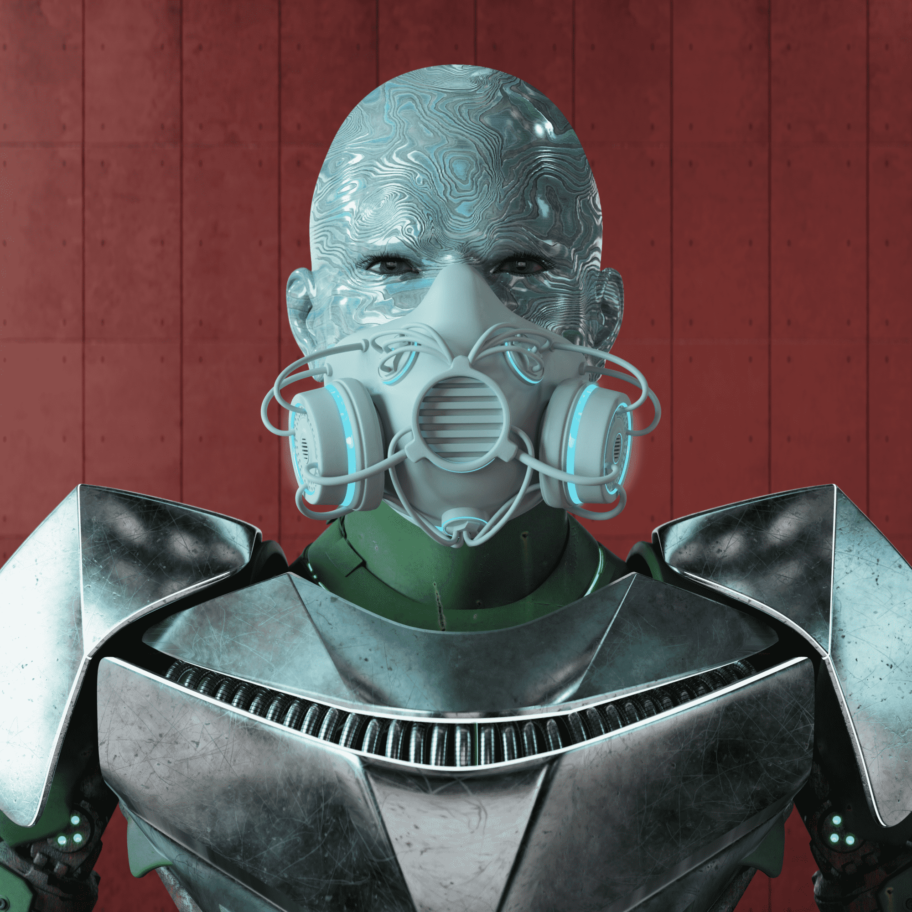

# Cybonix

你现在正在进入沃登月亮的黑暗面。

这一年是 2777 年，赛博尼克斯半机械人被艾尔多神秘主义者赶出了他们的家乡 Cygonia。

由于只有 1,500 名最精锐的 Cybonix 在最初的攻击中幸存下来，他们撤退到了位于沃登月球黑暗面的绝密太空设施。

在这里，机械人正在重建和训练，以报复那些野蛮掠夺他们世界的神秘军阀。

Cybonix 是在以太坊区块链上铸造的 1,500 个 NFT 的集合。我们正在打造下一代机器人战士，加入 Twitter 和 Discord 社区，了解如何成为这一代人的一部分。

