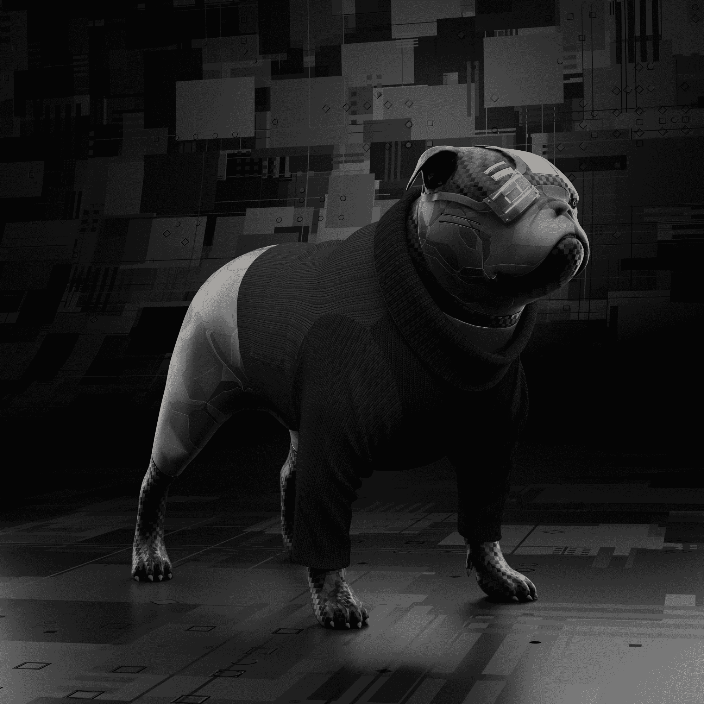

# Cyborg86 CyDog NFT

CYDOG86是 CYBORG86 的第二个系列。它们的创建是为了奖励持有人的朋友，这是一只无论如何都会永远和他们在一起的宠物。Cydogs 作为ERC-721 令牌存储在以太坊区块链中，并托管在行星际文件系统 (IPFS) 上。CYBORG 86代表 8,600 个独特的机器人的集合，按稀有程度分类，并由数百种元素生成。
CYBORGS作为 ERC-721 代币存储在以太坊区块链上，并托管在星际文件系统 (IPFS) 上。

我们的目标是创建一个围绕 Web 3.0 机会聚集的投资者和企业家社区。

该路线图描述了我们希望将 CYBORG86 带到哪里。
更多的机会、活动和特别的惊喜即将到来……

