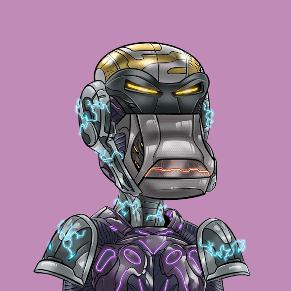

# Cyborg Billionaire Club

亿万富翁俱乐部的半机械人是独家NFT，只能通过派对猿集合中的两个NFT融合产生。该集合不能铸造，并且可以获得抵押奖金和社区银行。

半机械人亿万富翁俱乐部NFT - 常见问题（FAQ）
▶ 什么是半机械人亿万富翁俱乐部？
Cyborg Billionaire Club是NFT（不可替代令牌）的集合。存储在区块链上的数字艺术品的集合。
▶ 有多少半机械人亿万富翁俱乐部代币存在？
总共有3，095个Cyborg Billionaire Club NFT.目前有1，082个所有者在他们的钱包中至少有一个Cyborg Billionaire Club NTF。
▶ 半机械人亿万富翁俱乐部最昂贵的销售是什么？
出售的最昂贵的Cyborg Billionaire Club NFT是Cyborg #6830。它在2022-06-22（2个月前）以$ 43.9的价格出售。
▶ 最近卖了多少半机械人亿万富翁俱乐部？
在过去的30天内，售出了4个Cyborg亿万富翁俱乐部NFT。
▶ 什么是流行的半机械人亿万富翁俱乐部替代品？
许多拥有Cyborg Billionaire Club NFT的用户还拥有Party Ape Billionaire Club，Guild Alpha Pass，Gray Boys：Science Lab和Gray Boys。

