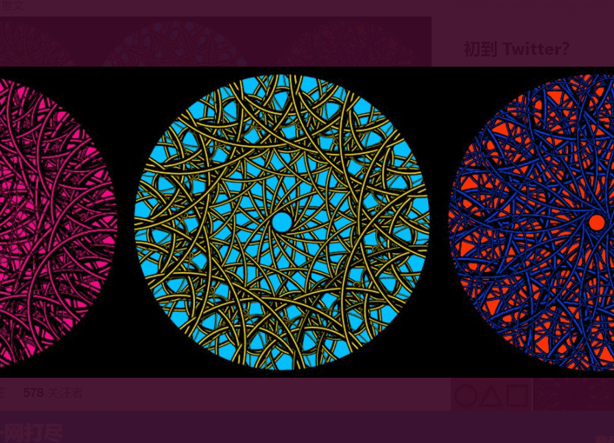

# Cyclical Project

动画艺术，完全由 p5.js 代码生成，备份并存储在链上。

Sunflower Industries 上第二个用户创建的项目。

抽象的、动画的、生成的艺术，沉思现实的周期性。

从我们的每一次呼吸到行星的旋转，循环的重复将时间和宇宙联系在一起。

反映这一点，代码循环通过重复旋转对称打印圆圈来创建这些旋转片段。

每件艺术品都是随机生成的，并存储在以太坊区块链上。

unflower Art 是一个去中心化的生成艺术平台。每件艺术品的代码、种子、描述和其他属性都存储在链上。每件艺术品都有自己的合同——主合同的代理——并且没有把关：任何人都可以在平台上创作作品。

