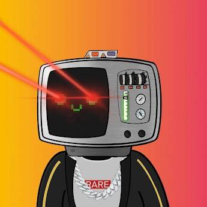

# Cypherbotz

▶ 什么是A共济会？
MASONS是NFT（不可替代令牌）的集合。存储在区块链上的数字艺术品的集合。
▶ 有多少A MASONS代币存在？
总共有9个A MASONS NFT.目前有3个所有者在他们的钱包里至少有一个A MASONS NTF。
▶ 最近卖了多少A MASONS？
在过去的30天内售出了0个MASONS NFT。

▶ 有多少A MASONS代币存在？
总共有9个A MASONS NFT.目前有3个所有者在他们的钱包里至少有一个A MASONS NTF。
▶ 最近卖了多少A MASONS？
在过去的30天内售出了0个MASONS NFT。

