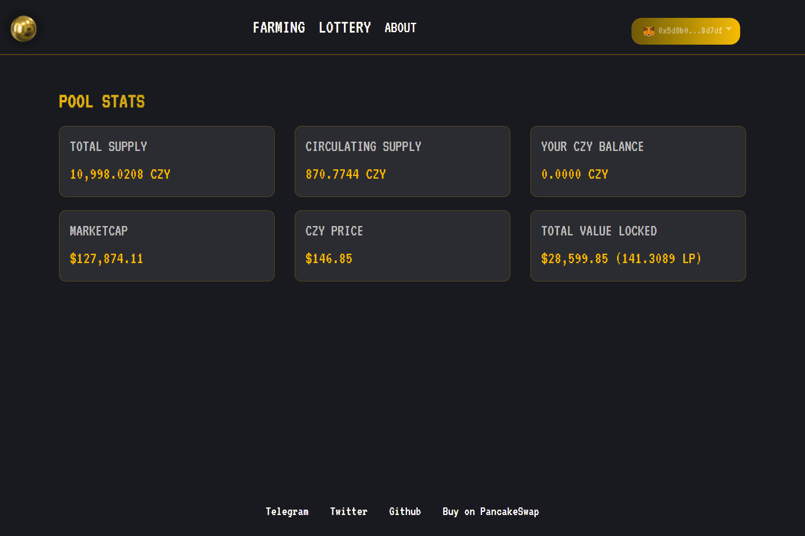

# CZY

CZY 是一个去中心化自治组织（DAO），致力于：加速 DeFi 在币安智能链上的发展和采用，同时为其成员创造高收益。这是 BSC 展示它可以为 DeFi 空间做些什么的独特时间和机会。 （代码是 YZY DAO 的一个分支）[http://czy.finance ](https://t.co/MeoOXh4Aui)[#BSC](https://twitter.com/search?q=%23BSC&src=hashtag_click) Stake [$BNB](https://twitter.com/search?q=%24BNB&src=cashtag_click)的高收益协议，收益：[$BTC](https://twitter.com/search?q=%24BTC&src=cashtag_click) + [$BNB](https://twitter.com/search?q=%24BNB&src=cashtag_click) + [$BUSD](https://twitter.com/search?q=%24BUSD&src=cashtag_click) + [$CZY](https://twitter.com/search?q=%24CZY&src=cashtag_click) 100% 社区拥有的协议加入：[http](https://t.co/cNB1HlEhT8)[ : ](https://t.co/cNB1HlEhT8)[//t.me/CZYfi](https://t.co/MeoOXh4Aui) [如果](https://twitter.com/CZYfinance)[@CZY金融](https://twitter.com/CZYfinance)2021年3月2日感谢您提交的所有有趣而有趣的作品。

