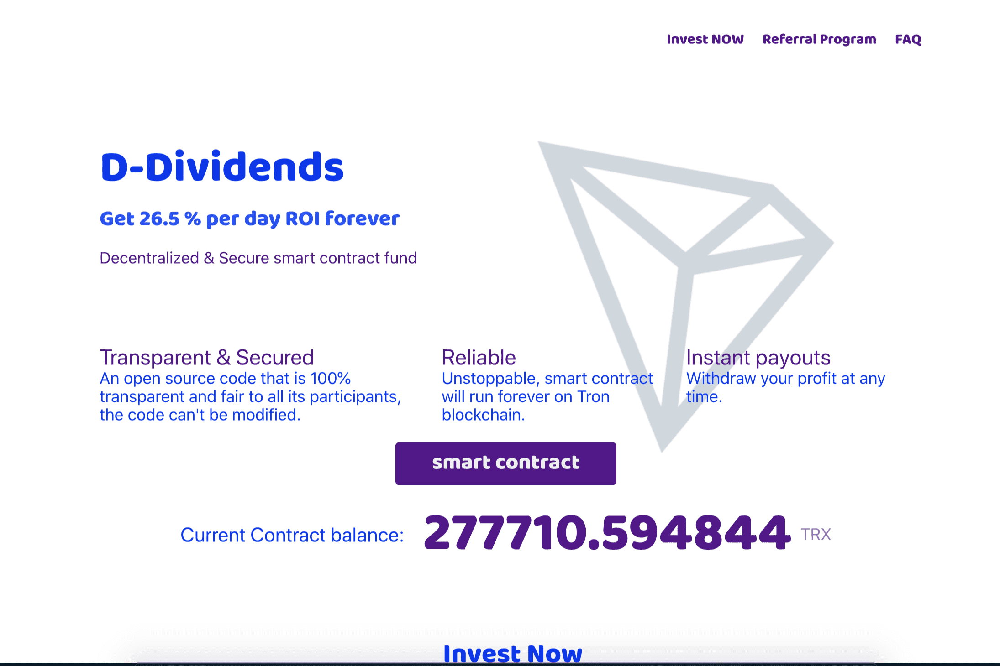

# D-DIVIDENDS

D-Dividends 是在 Tron 区块链上运行的智能合约，源代码经过验证，可在此处查看。任何人都不能修改源代码或删除智能合约。这意味着 D-Dividends 是完全去中心化和自治的，D-Dividends 是基于社区资金的支持。这个社区的每个人都在投资和互相帮助。通过投资，您每天可获得 26.5% 的投资回报率。为了增加他们的收入并确保合同永远不会失去平衡，再投资和推荐计划就在那里。最重要的是，更多项目即将推出，这将有助于 D-Dividends 更快地增长。

