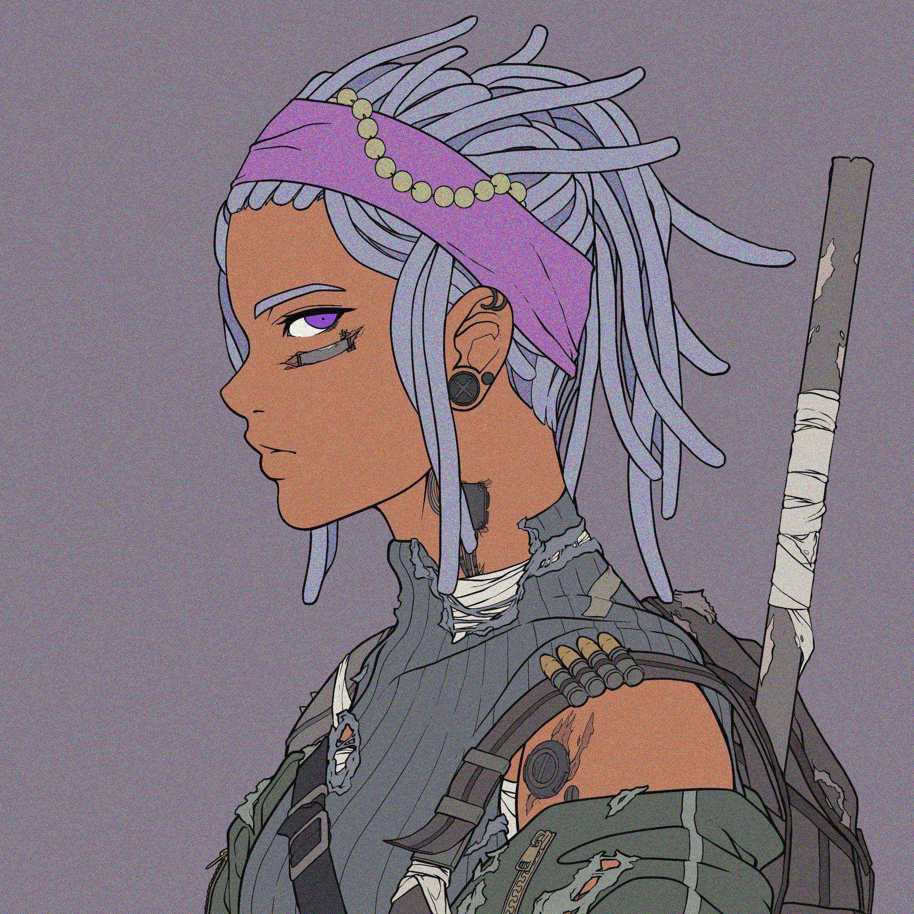

# Divine Anarchy - Wasteland

一个分裂的世界
来自 9 个不同血统的 10,000 名公民已被选中参加神圣法庭。5,000 名市民是英雄，另外 5,000 名是 Nemesis。
大洪水
正如故事所说，由于人类的傲慢，造物主向世界投下了洪水。地区被摧毁。社会流离失所。发誓再也不会让人类遭受这样的命运，十位虚灵君主被选中代替他进行审判。造物主认为世界的命运应该掌握在居住者的手中，以虚灵君主为首，形成了神庭。

大洪水已经六千年了。由于人类的堕落，Ethereal Monarchs再次行使了他们对人类作出判断的与生俱来的权利。

无论人类的意图是好的、邪恶的还是冷漠的，每个被选中参加神圣法庭的人都是变革的推动者。

