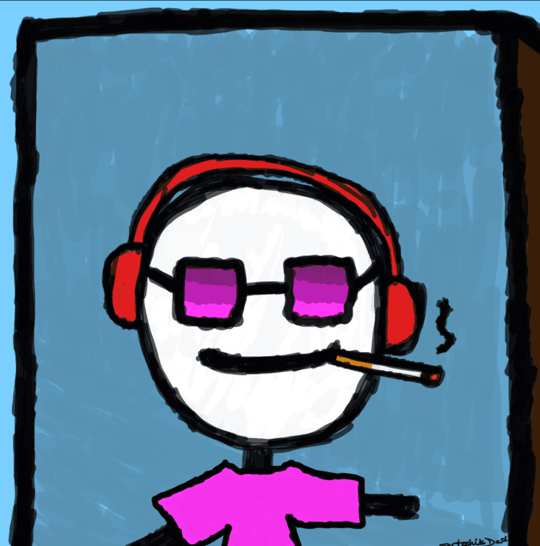

# dadfers

爸爸完全由sartoshis爸爸的手绘产生。该项目属于公有领域;随意使用爸爸任何你想要的方式。

▶ 什么是爸爸？ dadfers是一个NFT（不可替代令牌）集合。存储在区块链上的数字艺术品的集合。

 ▶ 有多少个达德弗斯令牌存在？ 总共有2，216个dagefers NFT.目前有109个所有者在他们的钱包中至少有一个dudgeers NTF。

▶ 什么是爸爸？ dadfers是一个NFT（不可替代令牌）集合。存储在区块链上的数字艺术品的集合。

 ▶ 有多少个达德弗斯令牌存在？ 总共有2，216个dagefers NFT.目前有109个所有者在他们的钱包中至少有一个dudgeers NTF。 

