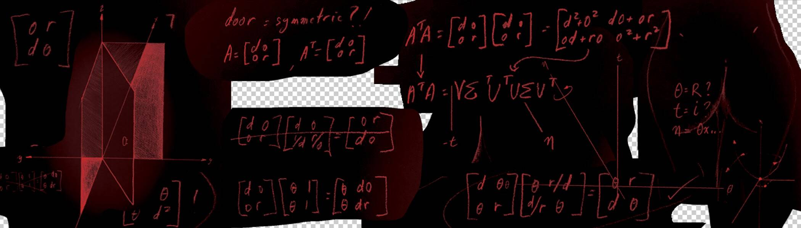

# Daemonica Entities

Daemonica Entities NFT在过去7天内售出2次。Daemonica Entities的总销售额为208.58美元。一个Daemonica实体NFT的平均价格为104.3美元。有437个Daemonica实体所有者，拥有1，107个代币的总供应量。
Daemonica Entities NFT - 常见问题解答（FAQ）
▶ 什么是 Daemonica Entities？
Daemonica Entities是一个NFT（不可替代令牌）集合。存储在区块链上的数字艺术品的集合。
▶ 有多少个 Daemonica Entities 令牌存在？
总共有1，107个Daemonica实体NFT.目前有437个所有者在他们的钱包中至少有一个Daemonica实体NTF。
▶ Daemonica Entities销售中最昂贵的是什么？
NFT出售的最昂贵的Daemonica Entities是janik.pha.hua。它在2022-06-30（约2个月前）以109.8美元的价格出售。
▶ 最近卖出了多少个Daemonica实体？
在过去30天内售出了3个Daemonica实体NFT。

