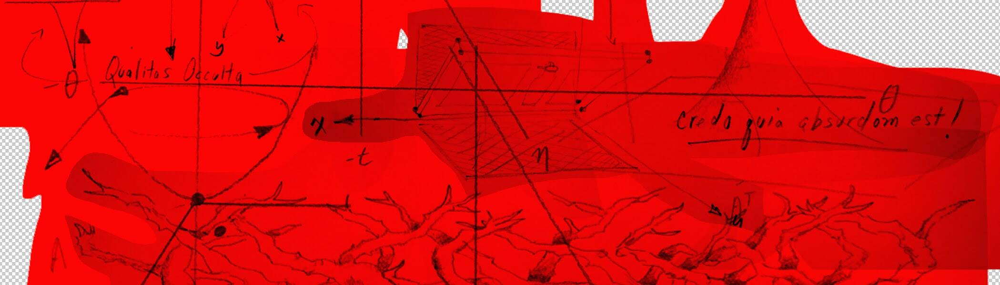

# Daemonica Xe_ntities

Xe_ntity充满了通过更改任何实体的属性来“变形”该实体的能力。Xe.ntity 所有者可以将其投射到他们拥有的实体上，以转换该实体的数字组合。Xe_ntity是一种世俗化的咒语，表示为一种功能。该函数是将实体吸引到另一个顺序中的东西。另一个顺序称为 ξ。

Daemonica Xe_ntities NFT - 常见问题解答（FAQ）
▶ 什么是 Daemonica Xe_ntities？
Daemonica Xe_ntities是一个NFT（不可替代令牌）集合。存储在区块链上的数字艺术品的集合。
▶ 有多少个Daemonica Xe_ntities令牌存在？
总共有361个Daemonica Xe_ntities NFT.目前有203个所有者在他们的钱包中至少有一个Daemonica Xe_ntities NTF。
▶ 最近卖了多少张Daemonica Xe_ntities？
在过去30天内售出了0个Daemonica Xe_ntities NFT。

