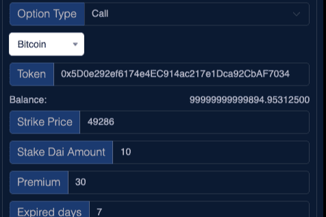

# Dai Option

Dai Option 是 Binance、Polygon、Fantom、Avalanche 上的去中心化期权交易所。您可以使用任何 ERC20 代币创建看涨或看跌期权。您可以指定行使价、溢价、交易金额、到期时间等。期权到期后，买方可以以行使价行权。权利人以 30 美元的溢价购买该期权，7 天后可以以每个 10 美元的价格购买代币，我的代币供应量为 20*Dai Option*是 Binance、Polygon、Fantom、Avalanche 上的去中心化期权交易所。您可以使用任何 ERC20 代币创建看涨或看跌期权。2020 年 2 月 14 日— Coinbase 的加密货币支付处理器 Coinbase Commerce 现在支持 MakerDAO 的稳定币*Dai* 

