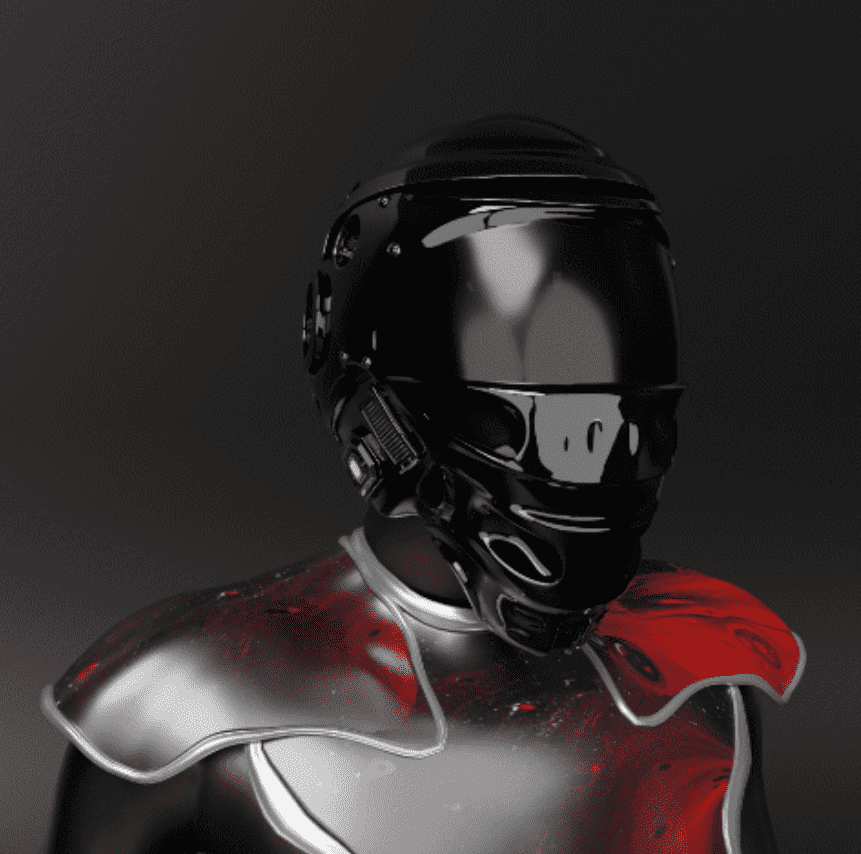

# DAO Avatars Moonopolis - City

DAO阿凡达月亮元界 这是管理一个城市在元界并获得超过10个收入来源。
DAO Avatars可以访问10多种收入来源：
💎身份证销售。DAO会员从出售Monopolis城市身份证中获得30%的收入。💎DAO Avatars Recrutement.在售出前2，000个头像后，剩余30%的头像将被发送到DAO。💎 版税。转售头像的5%的版税将发送到DAO Moonopolis。💎 创建和销售新的DAO头像。在售出5，000个头像后，DAO可以做出决定并再出售5，000个头像，并将收入的40%发送给DAO。💎 来自元界项目的收入。💎聪明的管理也带给你收入！此外，在NFT Moon Metaverse推出之前，DAO Avatars的所有者也可以获得收入。
DAO阿凡达穆诺波利斯 - 城市NFT - 常见问题（FAQ）
▶ 什么是DAO Avatars Moonopolis - City？
DAO Avatars Moonopolis - City是NFT（不可替代的令牌）集合。存储在区块链上的数字艺术品的集合。
▶ 有多少 DAO 头像 Moonopolis - 城市令牌存在？
总共有99个DAO Avatars Moonopolis - City NFTs.目前有57个所有者在他们的钱包中至少有一个DAO Avatars Moonopolis - City NTF。
▶ 最近卖了多少 DAO 头像 Moonopolis - City？
有0 DAO Avatars Moonopolis - 城市NFT在过去30天内售出。

