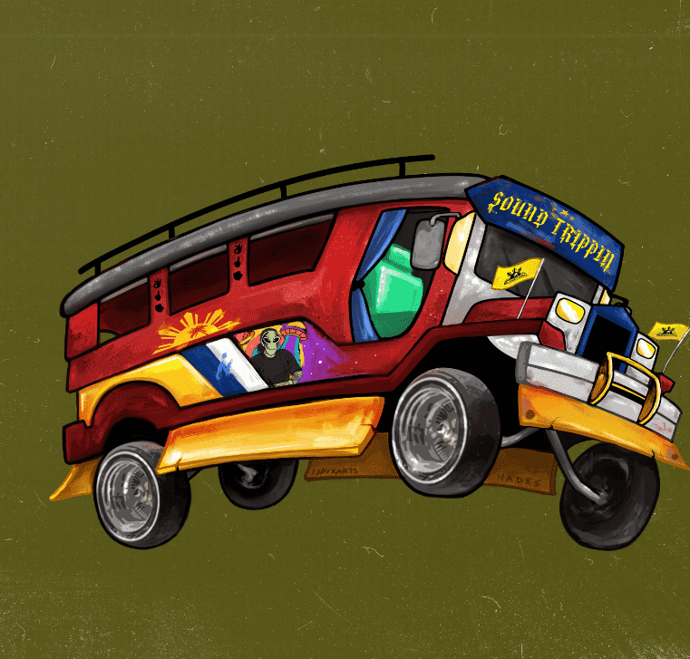

# DAOrecords

自2019年以来，音乐产业的民主化。
DAOrecords NFT - 常见问题（FAQ）
▶ 什么是DAOrecords？
DAOrecords是一个NFT（不可替代令牌）集合。存储在区块链上的数字艺术品的集合。
▶ 有多少DAOrecords代币存在？
总共有351个DAOrecords NFT.目前有92个所有者在他们的钱包中至少有一个DAOrecords NTF。
▶ DAOrecords最昂贵的销售是什么？
NFT出售的最昂贵的DAOrecords是Sabotawj和Deejay Philly - Link Up （Intro） - 由Creston Roswell和Deejay Philly制作。它在2022-08-10（16天前）以$ 7的价格出售。
▶ 最近卖出了多少个DAOrecords？
在过去30天内售出了1个DAOrecords NFT。

