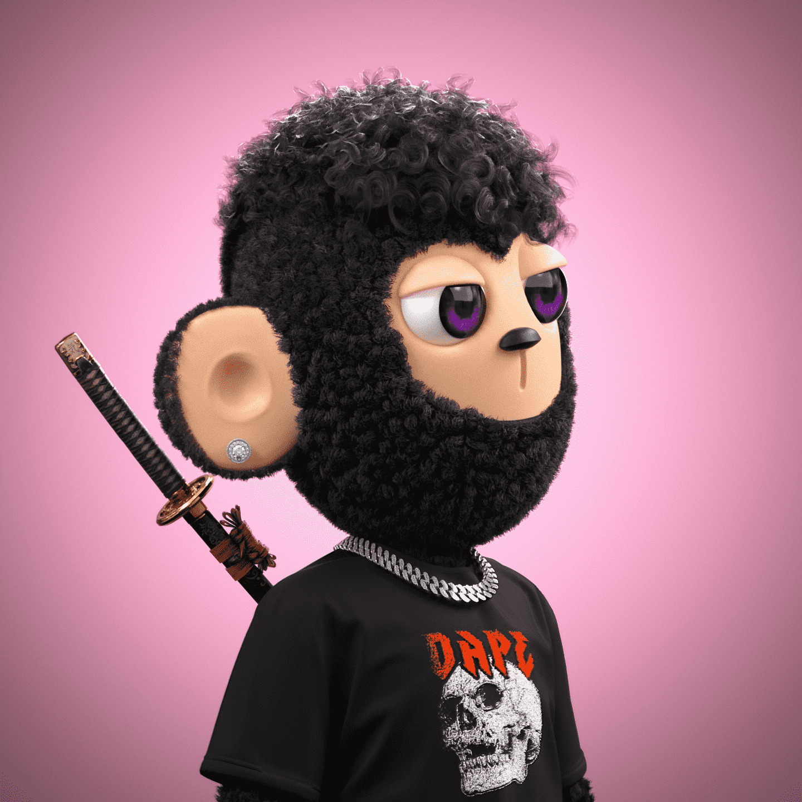

# DAPE: Activated

作为角色和时尚专家，Farhal 是 DAPE 的主要创造者和创始人。也因与音乐界知名人士合作而闻名。YSL，大西洋唱片，300 Ent，Trippie Redd。拥有九年专业知识的企业家和高级产品设计师，TAO 曾与全球最好的初创企业合作。他现在正在构建 Web3 的新征程，怀揣梦想加入 DAPE 团队。

DAPE：创世纪统计
创建于 6 个月前
2,444 代币供应
OpenSea 验证集合
6% 费用
58,760 名 Discord 成员
193,930 位推特关注者
DAPE：Genesis NFT 在过去 7 天内售出 20 次。DAPE：Genesis 的总销售额为 2.07 万美元。一个 DAPE：Genesis NFT 的平均价格为 103.3 美元。有 1,064 名 DAPE: Genesis 所有者，总共拥有 2,444 个代币。

区块链上 2444 个最小样式 DAPE 的创世集合。

受社区启发和推动的文化风格特征。

