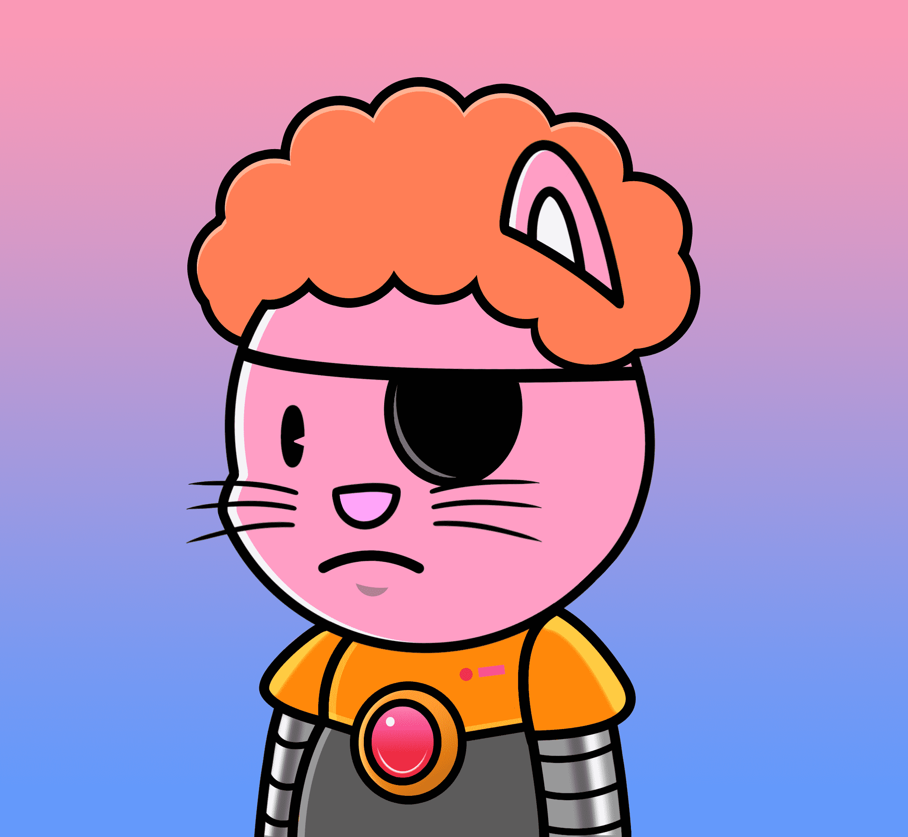

# Dapp Cats

一群猫在探索dapps和游戏。100%不含薄荷。8024/8024独特的艺术品铸造。没有团队，没有路线图。
Dapp Cats NFT - 常见问题（FAQ）
▶ 什么是Dapp Cats？
Dapp Cats是一个NFT（不可替代令牌）集合。存储在区块链上的数字艺术品的集合。
▶ 有多少个Dapp Cats代币存在？
总共有8，024个Dapp Cats NFT.目前有1，887个所有者在他们的钱包中至少有一个Dapp Cats NTF。
▶ 最昂贵的Dapp Cats销售是什么？
最昂贵的Dapp Cats NFT出售的是Dapp Cats #34。它在2022-06-05（3个月前）以5.5美元的价格出售。
▶ 最近卖了多少只Dapp猫？
在过去的30天内售出了1个Dapp Cats NFT。

