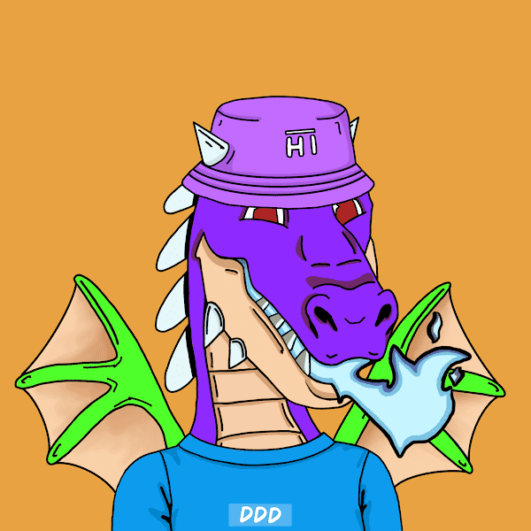

# Daring Dragon Den

Daring Dragon Den是6，000个独特的NFT收藏品的集合，在以太坊区块链上运行。与其他150个特征和特征一起，每条龙都是独一无二的。有关更多详细信息，请访问 www.DaringDragonDen.com
敢龙登NFT - 常见问题（FAQ）
▶ 什么是敢龙穴？
Daring Dragon Den是NFT（不可替代令牌）的集合。存储在区块链上的数字艺术品的集合。
▶ 有多少只敢龙穴令牌？
总共有276个敢龙窝NFT.目前有104个所有者在他们的钱包里至少有一个敢龙窝NTF。
▶ 最近卖了多少只大龙穴？
在过去的30天内售出了0个大胆的龙窝NFT。

