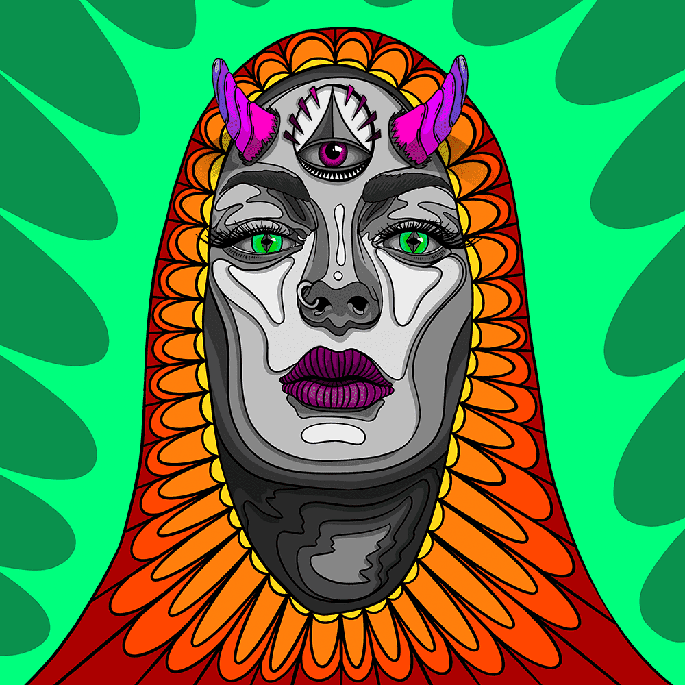

# Prima Donna by Dario De Siena

达里奥·德·锡耶纳 (Dario De Siena) 的 Prima Donna 统计
创建于 10 个月前
1,716 代币供应
7.5% 费用
3,029 名 Discord 成员
2,418 位推特关注者
Dario De Siena NFT 的 Prima Donna 在过去 7 天内售出 7 次。Dario De Siena 的 Prima Donna 的总销售额为 149.15 美元。Dario De Siena NFT 的 Prima Donna 的平均价格为 21.3 美元。Dario De Siena 拥有 719 名 Prima Donna，总共拥有 1,716 个代币。

混音！收藏

Dario De Siena 与 REMIX 合作！团队创建了 Prima Donna，这是 Dario 的第一个生成艺术项目。该系列包括 2,000 件独特生成的艺术品，具有达里奥经典的多彩和迷幻风格。

