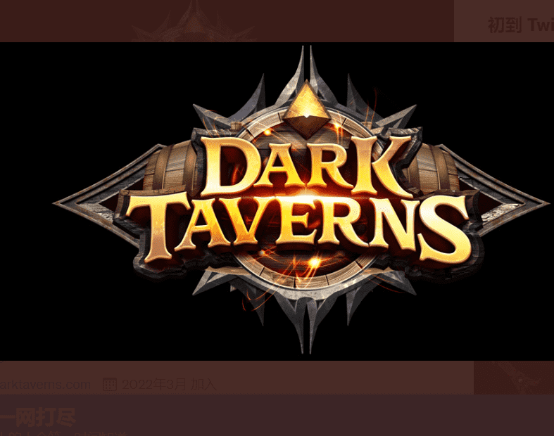

# DarkTaverns

Dark Taverns 是一款开放世界的 MMORPG，设置在一个充满隐藏秘密和魔法的独特幻想世界中。探索深林，发现神秘生物和物品……与朋友建立公会以对抗新威胁……或独自探索世界！发现地牢、宝藏和奥秘，帮助您完成任务！玩我们不断扩展的冒险，了解更多关于这个故事的信息，同时击倒你的敌人！铸币前——美国东部标准时间 8 月 10 日下午 1 点
公共铸币厂——美国东部标准时间 8 月 11 日下午 1 点

价格 = Eth L1 上的 0.05 eth

您将在 Eth L1 上铸造 Taverns。这些酒馆带有一个铸造钥匙，将在 Immutable X 上铸造，解锁额外的物品，例如坐骑、翅膀和武器，这些物品也在 Immutable X 揭示后铸造。我们不会有代币。

大多数化妆品都可以锻造成 NFT。在游戏过程中，您可以完成一个任务并获得奖励。如果符合条件，该游戏内物品可以锻造成 NFT，然后可以在市场上出售/购买。

