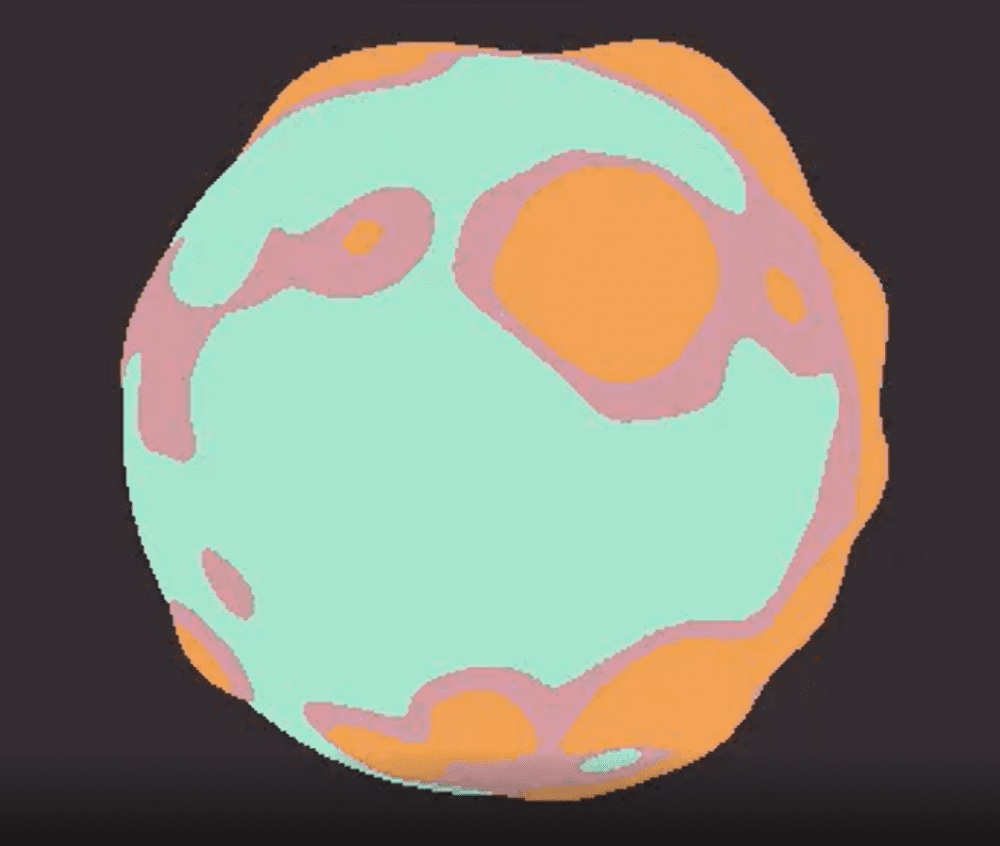

# Dark Forest v0.6 - Valhalla

奖励行星NFT授予黑暗森林v0.6的获奖者。
黑暗森林 v0.6 - 瓦尔哈拉 NFT - 常见问题（FAQ）
▶ 什么是黑暗森林 v0.6 - 瓦尔哈拉？
黑暗森林 v0.6 - 瓦尔哈拉是一个NFT（不可替代的令牌）集合。存储在区块链上的数字艺术品的集合。
▶ 有多少黑暗森林 v0.6 - 瓦尔哈拉令牌存在？
总共有310个黑暗森林v0.6 - 瓦尔哈拉NFT.目前有204个所有者在他们的钱包里至少有一个黑暗森林v0.6 - 瓦尔哈拉NTF。
▶ 最近卖了多少黑暗森林v0.6 - 瓦尔哈拉？
有1个黑暗森林v0.6 - 瓦尔哈拉NFT在过去30天内售出。

