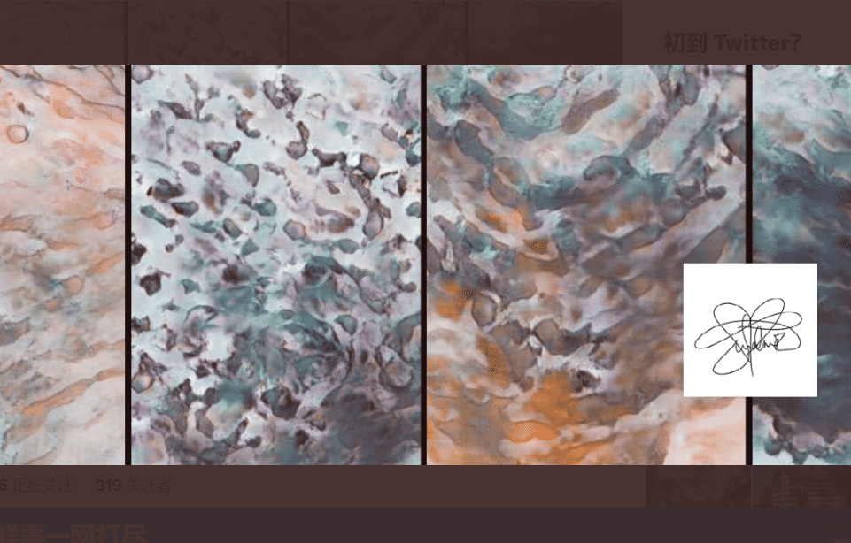

# Darkwave 1

我将提供的下一个系列作品称为 Darkwave。 这些作品的创作方式与我的 Waveforms 类似，通过使用保持空间和直观创作的冥想练习，然后使用该作品训练 AI 模型以生成新作品。 我对现象学信息进行反思，并将这些作品向前发展成不断变化的运动。 结果是类似于波形、情绪变化和变化的冥想剪辑，有时漂浮在水下，抬头仰望太阳。

Darkwave 继续探索保持空间和激进希望的主题。 无论我们身在何处，这些都是接受、影子工作和发现美的工作。 如果您需要它们，这些空间就在这里。 

