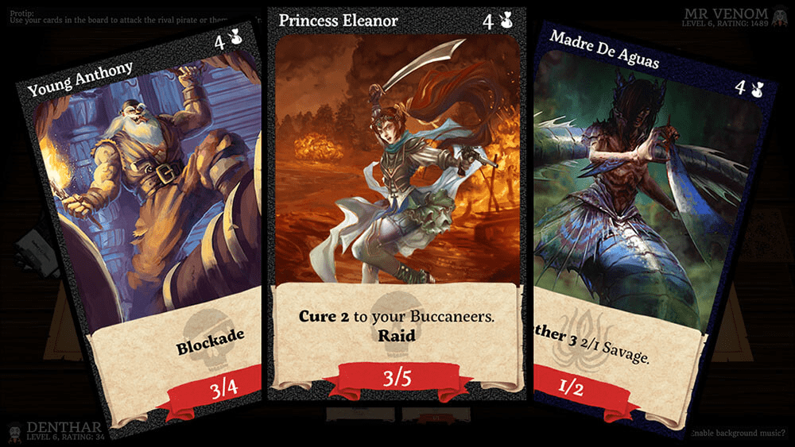

# Darkwinds

Darkwinds 是一款运行在以太坊网络之上的在线交易纸牌游戏。更具体地说，所有 Darkwinds 卡都是不可替代的代币或加密收藏品，这是虚拟对象的新标准，玩家在游戏生态系统内外拥有永久出售、交易和赠送其物品的权利。这要归功于使加密货币成为可能的相同技术，因为 Darkwinds 卡存在于所有以太坊令牌使用的同一区块链上。Darkwinds 即将推出，卡片可在 OpenSea 市场上交易[加入官方 Darkwinds Discord 服务器并与其他加密货币海盗会面进行交易

