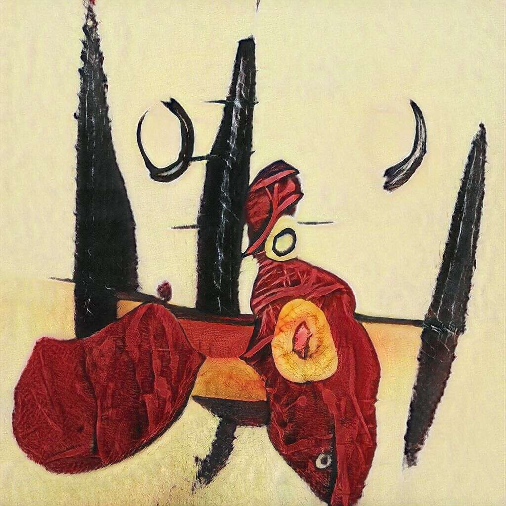

# Dart Art Abstract

飞镖艺术抽象统计
创建于大约 1 年前
1,112 代币供应
OpenSea 验证集合
5% 费用
过去 7 天内没有售出 Dart Art Abstract。

Dart Art Abstract 是一系列使用 stylegan2 制作的抽象 AI 生成艺术，移动潜在空间，并在艺术数据集上进行训练。该模式于 2019 年进行训练，并于 2021 年运行推理。由前麻省理工学院和伯克利人工智能研究工程师创建。

Dart Art Abstract NFT - 常见问题（FAQ）
▶ 什么是飞镖艺术摘要？
Dart Art Abstract 是一个 NFT（Non-fungible token）集合。存储在区块链上的数字艺术品集合。
▶ 有多少 Dart Art Abstract 代币？
总共有 1,112 个 Dart Art Abstract NFT。目前，382 位所有者的钱包中至少有一个 Dart Art Abstract NTF。
▶ 最昂贵的 Dart Art Abstract 拍卖会是什么？
售出的最昂贵的 Dart Art Abstract NFT 是 Dart Art Abstract #1001。它于 2022-08-20（13 天前）以 1.4 美元的价格出售。
▶ 最近卖出了多少 Dart Art Abstract？
过去 30 天内售出了 1 个 Dart Art Abstract NFT。
▶ 什么是流行的 Dart Art Abstract 替代品？
许多拥有 Dart Art Abstract NFT 的用户还拥有 The Panels-Blocks、 Abstract Loot、 DogeLife和 CryptoMorph。

