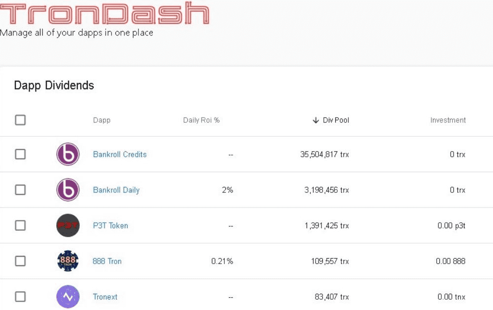

# DASH Token

DASH 是一种与 TronDash.com 相关联的通货紧缩代币，这是一种创新实用程序，可让您在使用 Tron 区块链的最流行的 dApp 上查看您的 div 收入。TronDash 的流动性农场是从 TronDash 平台获利的最佳方式。您的 TDDFRM 份额使您有权获得社区存款分配、TTDLP 保留代币其赚取的费用、每日 2% 的池支出，并为 TDD-TRX 质押池提供流动性，鼓励交易和费用产生，从而提升您的 TDDFRM 质押头寸的价值.通过将您的 TRX 存储在 DashBank 中被动赚取 div 以10 比 1 的比例为前 100 万个 DASH挖矿 Dash每存入 100,000 个 trx，就有 25,000 个 DASH 空投到 DashBank

