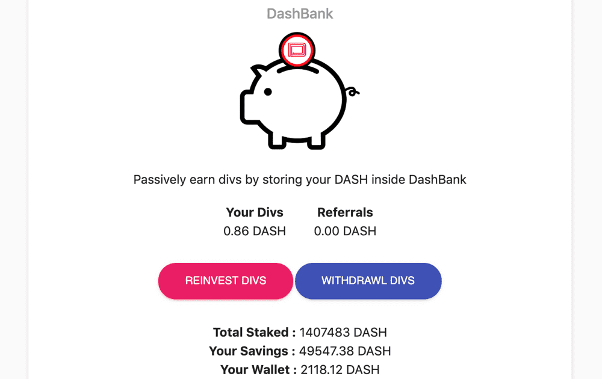

# DashBank

通过将您的 DASH 存储在 DashBank 中被动赚取 div 存款/取款收取 10% 的交易费用，然后分配到股息池*Dash*让您可以自由地以任何方式转移资金。*Dash*以不到一美分的价格立即将资金转移到任何地方，任何人*Dash*是用于成长品牌的数字资产管理 (DAM) 工具。您所有的视觉内容都集中在一个地方。搜索、组织、与您的团队协作。*Dash*是一个统一支付平台，旨在改善 13 亿非洲人如何使用数字货币进行交易。*Dash*消除障碍并实现财富创造。

