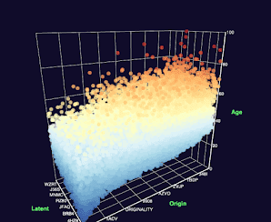

# Data Poets Viz

Data Poets Viz 是一系列显示数据可视化的令牌，由我根据我作为 Web 3.0 领域的独立开发人员在整个旅程中收集的数据创建。
数据诗人可视化 NFT - 常见问题解答（FAQ）
▶ 什么是数据诗人可视化？
Data Poets Viz 是一个 NFT（不可替代令牌）集合。存储在区块链上的数字艺术品的集合。
▶ 有多少个数据诗人可视化令牌存在？
总共有1个数据诗人，即NFT。目前有27个所有者在他们的钱包里至少有一个数据诗人，即NTF。
▶ 最昂贵的Data Poets Viz销售是什么？
Viz NFT出售的最昂贵的Data Poets是From Birth。它在2022-06-06（3个月前）以$ 988.9的价格出售。
▶ 最近售出了多少个数据诗人可视化？
在过去 30 天内售出了 20 个 Data Poets，即 NFT。
▶ 数据诗人可视化的成本是多少？
在过去的30天里，最便宜的数据诗人Viz NFT销售额低于629美元，最高销售额超过989美元。Data Poets Viz NFT 在过去 30 天内的中位数价格为 629 美元。

