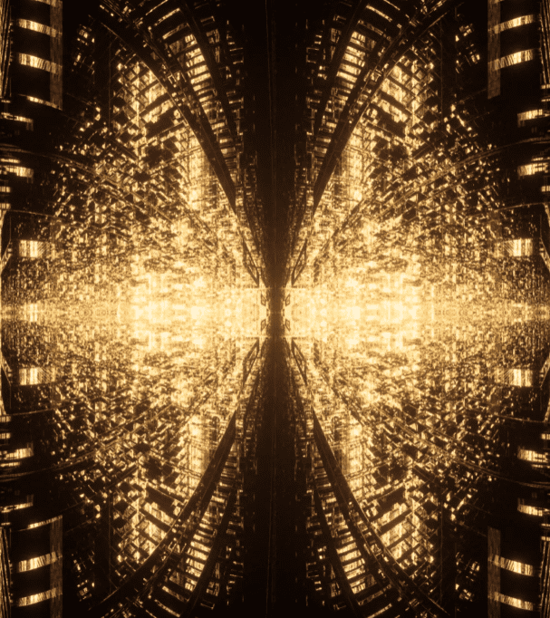

# David Ariew X Tatler China

TR Lab与Tatler中国和艺术家David Ariew合作，很高兴地宣布David的NFT艺术品Fractal Monarch的在线销售。这次合作标志着一个里程碑：当David Ariew的数字艺术作品Fractal Monarch的静止图像出现在Tatler China的封面上时，它标志着NFT首次在中国杂志上这样做。TR Lab很荣幸能够促进艺术品的销售，拍卖收入的一半将捐赠给全球非营利组织香港救助儿童会。

David Ariew的分形君主描绘了一种以黑色和金色渲染的未来主义数字昆虫，以与Tatler的主题颜色相对应。这项工作的灵感来自蝴蝶效应现象，象征着一个小小的贡献如何对孩子的未来产生巨大的影响。
大卫·阿里乌 X 塔特勒中国 NFT - 常见问题（FAQ）
▶ 什么是大卫·阿里尤 X·塔特勒中国？
David Ariew X Tatler China是NFT（不可替代令牌）集合。存储在区块链上的数字艺术品的集合。
▶ 有多少个David Ariew X Tatler China代币存在？
总共有77个David Ariew X Tatler China NFT.目前有76个所有者在他们的钱包中至少有一个David Ariew X Tatler China NTF。

