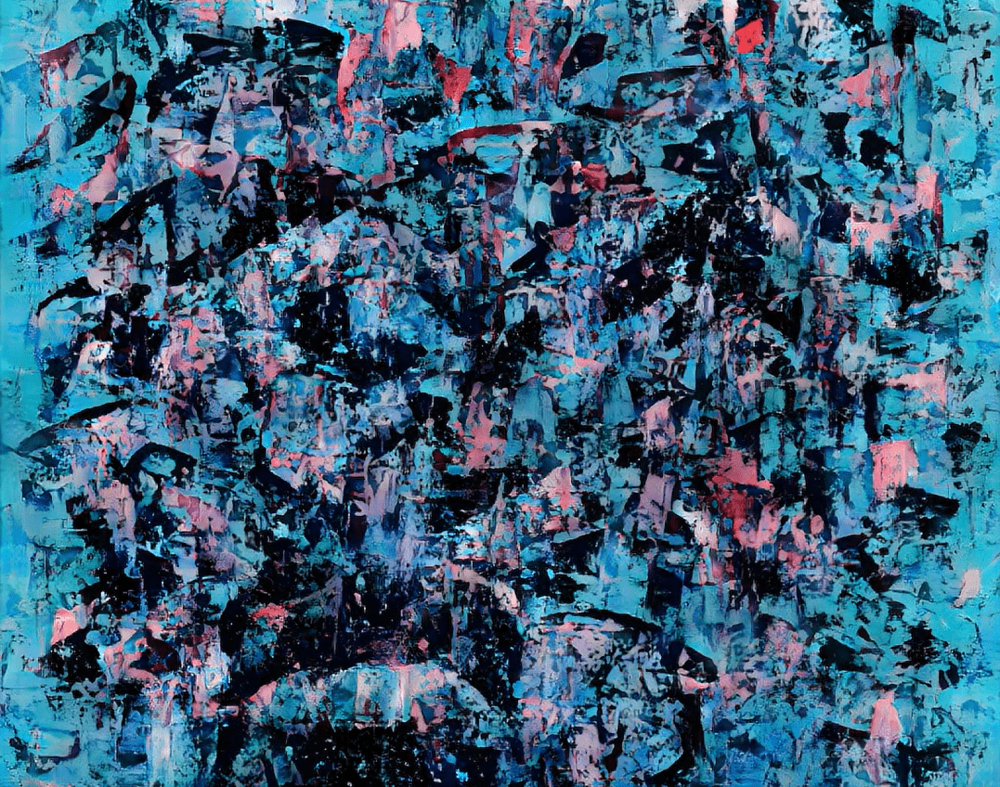

# David Rees

油画遇见AI。

紧急事件 - 主要的NFT。持有者将获得“越轨”空投。第一位收藏家还将收到原始油画（如果他们愿意），其中包含独特的增强现实视频。

迭代 - 探索绘画可能是什么的变体的短途旅行。
大卫·里斯 NFT - 常见问题（FAQ）
▶ 什么是大卫·里斯？
David Rees是NFT（不可替代令牌）集合。存储在区块链上的数字艺术品的集合。
▶ 有多少个大卫·里斯代币存在？
总共有10个David Rees NFT.目前有10个所有者在他们的钱包里至少有一个David Rees NTF。
▶ 大卫·里斯（David Rees）最昂贵的销售是什么？
David Rees NFT出售的最昂贵的是A Relic。它在2022-07-04（约2个月前）以1.7k的价格出售。

