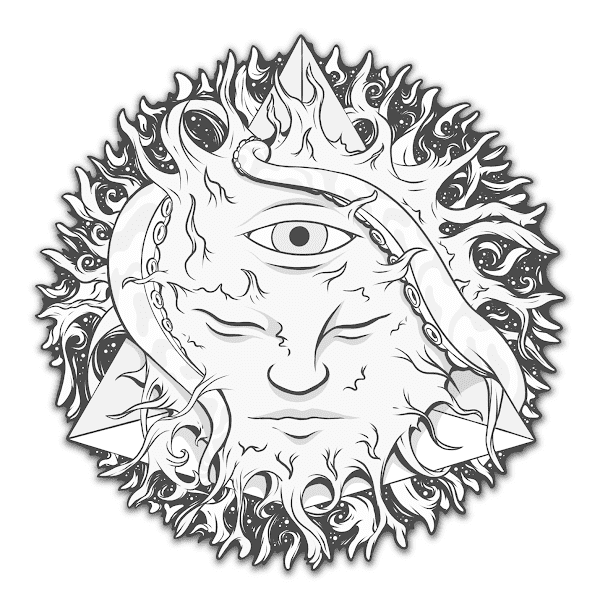

# Summer Solstice: Dawn of Eris 2022

夏至：阋神星2022年的黎明NFT在过去7天内售出7次。《夏至：阋神星黎明2022》的总销量为292.01美元。一个夏至的平均价格：阋神星2022年的黎明NFT为41.7美元。有788个夏至：阋神星2022年的黎明所有者，拥有861个代币。

光明会很自豪地推出夏至：厄里斯的黎明，这是一个以夏至为主题的沉浸式体验，庆祝不和谐女神的重生。Eris通过她的追随者的奉献精神为NFT空间带来了光明，创造力和重塑。在这个庆祝的日子里加入我们，我们将一起利用太阳的力量来真正照亮。今晚，我们完全清醒了。明天，我们又回到了阴影中，再次隐藏着我们的秘密。
夏至：阋神星的黎明 2022 NFT - 常见问题（FAQ）
▶ 什么是夏至：阋神星的黎明2022？
夏至：阋神星的黎明2022是NFT（不可替代令牌）集合。存储在区块链上的数字艺术品的集合。
▶ 有多少夏至：阋神星2022年的黎明代币存在？
总共有861个夏至：阋神星的黎明2022 NFT.目前有788个所有者在他们的钱包里至少有一个夏至：阋神星2022 NTF的黎明。
▶ 最昂贵的夏至：阋神星2022年销售的黎明是什么？
最昂贵的夏至：阋神星2022 NFT出售的是IlatiNFT夏至：阋神星2022的黎明。它在2022-06-25（2个月前）以$ 205.3的价格出售。
▶ 最近卖了多少个夏至：阋神星的黎明2022？
在过去的30天内，有232个夏至：阋神星2022年的黎明NFT售出。

