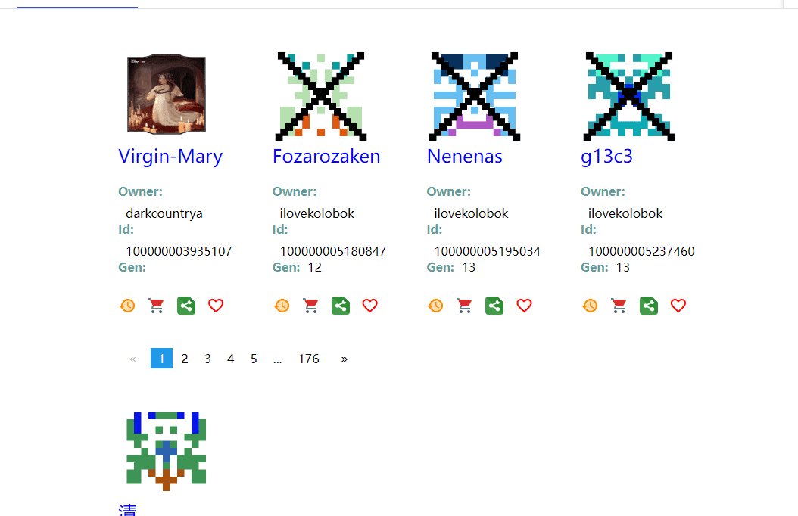

# dCart

dCart 是一个基于区块链技术的数字资产/商品交易的去中心化电子商务平台。由 OpenBRM 提供支持 - 多链多 Dapp 平台dCart 是一个基于区块链技术的数字资产/商品交易的去中心化电子商务平台Dcart提供并能够在结帐前在购物车页面或购物车抽屉中应用折扣代码。令人惊叹的视觉效果。多种款式的折扣盒.浏览我们的*dcart*选择，从我们的家居装饰店中找到最好的独特或定制作品。“ *dcart* ”杂志和传播与营销杂志，我很荣幸向您提出此请求，以引起您对我们的关注

