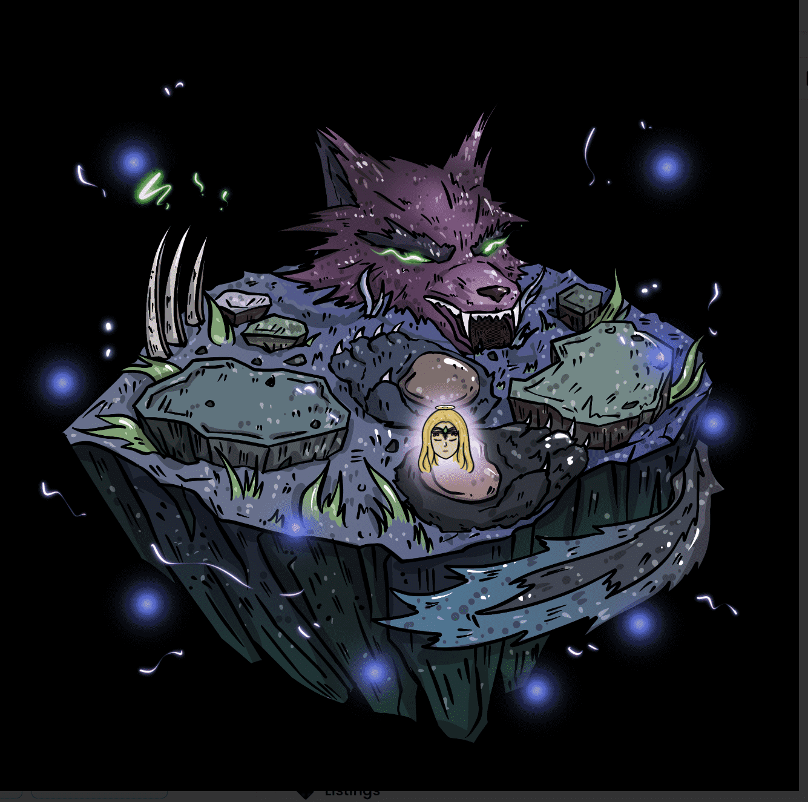

# De-Generations L

清理你的狗屎，为堕落做好准备，为这个混乱的世界做好准备？退化：S NFT - 常见问题（FAQ）
▶ 什么是退化：S？
De-Generations：S 是一个 NFT（不可替代代币）集合。存储在区块链上的数字艺术品集合。
▶ De-Generations: S 代币有多少？
总共有 6,736 个 De-Generations：S NFT。目前，2,018 位所有者的钱包中至少有一个 De-Generations: S NTF。
▶ 什么是最昂贵的 De-Generations: S 特卖？
最昂贵的 De-Generations: S NFT 出售的是 Wolf Queen #1749。它于 2022 年 6 月 23 日（2 个月前）以 22,000 美元的价格售出。
▶ De-Generations: S 最近卖了多少？
过去 30 天内售出了 991 个 De-Generations: S NFT。
▶ De-Generations: S 的费用是多少？
在过去 30 天里，最便宜的 De-Generations: S NFT 销售额低于 244 美元，最高销售额超过 933 美元。 De-Generations: S NFT 在过去 30 天内的中位数价格为 438 美元。
▶ 什么是流行的 De-Generations: S 替代品？
许多拥有 De-Generations 的用户：S NFT 还拥有 NoShitZone、Pixelverse Poops、ShitPlunger 和 ShitBeast。
