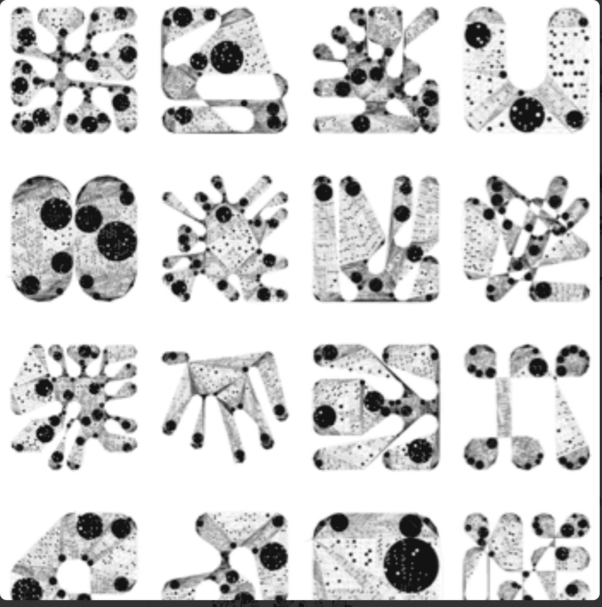

# Dead Ringers: Edition by Dmitri Cherniak

2022 年 1 月的每一天，我都会从算法中生成一个新输出，生成一个随机钱包地址，然后将工作发送到该地址。在最后一天，即 1 月 31 日，所有之前的死铃被放置在一个 5 x 6 的网格中，并铸造到一个生成的地址。

鉴于有 16 到 40 个可用地址，几乎可以保证任何收到 Dead Ringers 的钱包都无法访问。我希望它可以帮助观察者了解地址空间的广阔性以及它为用于分发工作的网络提供的底层安全性。

