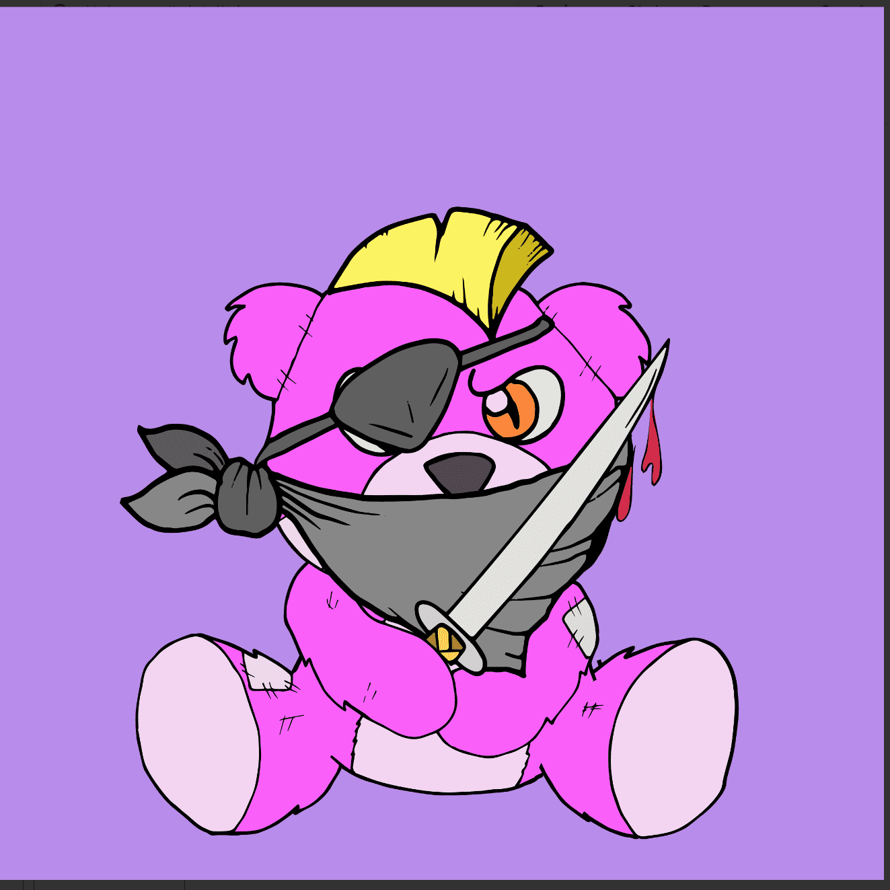

# Deadbears Official

一系列庆祝熊的垮台，收集了 10,000 个独特的 NFT，既有趣又暴力。每个 NFT 将花费 0.05 ETH。

欲了解更多信息，请加入我们的 Discord 服务器。

13日星期五发售。该范围内有多少 NFT，铸币成本是多少？
有 10,000 个 NFT，包括 75 个 Floki Pup NFT。每个 NFT 的铸币成本为 0.05 ETH + 以太坊 Gas 费

国库奖励将如何使用？
筹集的 30% 的 ETH 将进入我们的国库，这相当于大约 150 ETH！

25% 将用于 Scavenger Hunt 奖励
5% 将用于创建 FLOKI 社区质押计划
您将如何在二级市场创造需求？
我们将开展社区寻宝活动，这些活动将直接通过我们的财政部获得奖励。完成这些狩猎可能需要参与者在二级市场上购买 Deadbears。

寻宝游戏将如何运作？
我们将定期发布寻宝游戏，挑战社区收集具有特定特征的 Deadbears NFT 集合。

在宣布每次狩猎后，我们将清楚地传达任务和可用的奖励，以便买家和卖家都能做出相应的反应。

