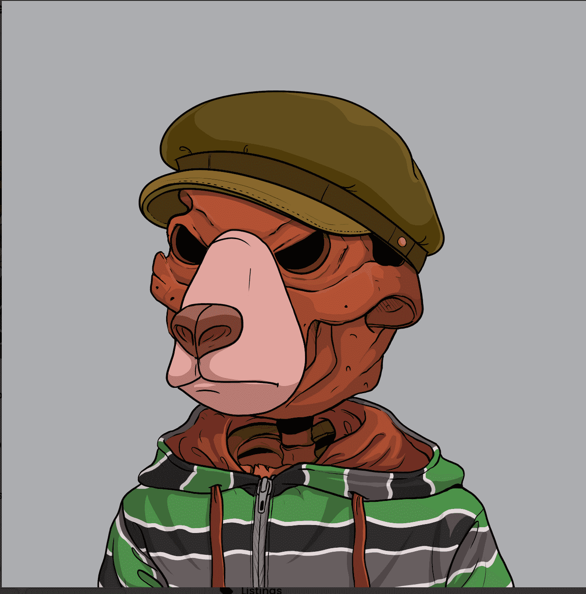

# Dead Bears - We Were Okay

什么时候火锅？
汤姆是 5 月 28 日，美国当天标准时间晚上 7 点。
火锅的价格是多少？
我们的铸币价格是0.03 ETH。我们所有的艺术作品都是100%原创的。
供应是什么？
可铸造4444只死熊，白名单成员可免费铸造444块。
什么区块链？
死熊在以太坊区块链上，我们的合约使用 ERC721a 来布地减少天然气战争。
关于我们
我们是 NFT 生态系统的一场新革命，努力建立熊都强大的社区——是死是活。由 4,444 只独特的熊组成的晨墓，让您可以单独进入地球，这是所有可以死去的地方脱鞋的地方。感觉了？我们支持。Dead Bears 是为了你，这就是我们承诺将 1% 的死捐赠给心理健康的原因。有时每个人都觉得死了……我们还好，现在我们死了，没关系。

